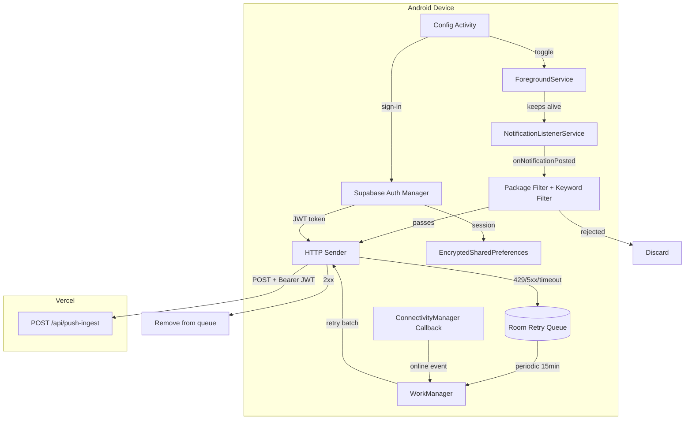
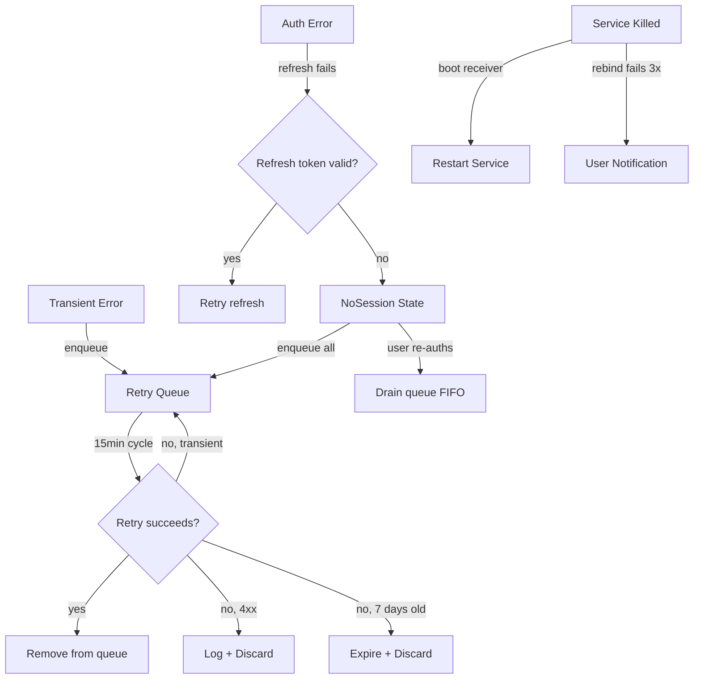

# Android Notification Forwarder — Design

## Overview

Native Android app (Kotlin) that captures financial notifications from whitelisted packages and forwards them to the Maquinita backend at `POST /api/push-ingest`. The app replaces the fragile Tasker + Autonotification setup with a resilient architecture based on Android's `NotificationListenerService`, a `ForegroundService` for process persistence, a Room-backed retry queue for guaranteed delivery, and Supabase Auth (Google OAuth) for user identity.

### Key Design Decisions

| Decision | Choice | Rationale |
|---|---|---|
| Notification capture mechanism | `NotificationListenerService` | Official Android API for reading notifications; survives Doze mode when paired with a ForegroundService |
| Process persistence | `ForegroundService` (specialUse, Android 14+) | Required to keep the listener alive; OS won't kill a foreground service under normal memory pressure |
| Local persistence | Room (SQLite) | Survives process death and reboots; schema-validated via compile-time annotations |
| Retry scheduling | WorkManager (periodic + one-shot expedited) | Battery-friendly, respects Doze constraints, survives reboots |
| HTTP client | OkHttp | Lightweight, configurable timeouts, interceptor chain for auth headers |
| Authentication | Supabase Auth (Google OAuth) → JWT as Bearer token | Same identity provider as the PWA; JWT validated server-side by the existing push-ingest auth layer |
| Token storage | EncryptedSharedPreferences | Hardware-backed encryption on devices that support it; standard Android secure storage |
| Build system | Gradle Kotlin DSL, minSdk 26, targetSdk 34 | Covers 95%+ of devices; Kotlin DSL enables type-safe build scripts |
| Distribution | Sideload APK (no Play Store) | Single-user personal app; avoids Play Store review overhead |

### Architecture Diagram



## Architecture

### Component Layers

1. **Capture Layer** — `NotificationListenerService` + `ForegroundService`
   - Receives system callbacks for all notifications
   - ForegroundService keeps the process alive with a silent persistent notification
   - BOOT_COMPLETED receiver restarts after reboot

2. **Filtering Layer** — Package whitelist + SMS keyword filter
   - First gate: package name must be in whitelist
   - Second gate (SMS only): text must contain at least one financial keyword
   - Dedup gate: same notification key within 2 seconds → discard

3. **Delivery Layer** — OkHttp + auth interceptor
   - Constructs JSON payload matching `pushPayloadSchema`
   - Attaches `Authorization: Bearer <JWT>` header
   - Routes responses to success path or retry queue

4. **Persistence Layer** — Room database + WorkManager
   - Failed deliveries stored in SQLite with full payload
   - WorkManager runs periodic retry every 15 minutes
   - Expedited retry on network restoration (debounced 30s)
   - 7-day TTL, 1000-entry cap

5. **Auth Layer** — Supabase Android SDK + EncryptedSharedPreferences
   - Google OAuth sign-in via Supabase
   - JWT stored encrypted, auto-refreshed before expiry
   - No-session state → enqueue without delivery

6. **UI Layer** — Single Config Activity
   - Service status, recent log, queue size, toggle, sign-in

## Components and Interfaces

### Project Structure

```
android/
├── app/
│   ├── build.gradle.kts
│   └── src/main/
│       ├── AndroidManifest.xml
│       ├── kotlin/com/maquinita/forwarder/
│       │   ├── MaquinitaApp.kt                  # Application class (DI setup)
│       │   ├── service/
│       │   │   ├── NotificationCaptureService.kt # NotificationListenerService
│       │   │   ├── ForwarderForegroundService.kt # ForegroundService
│       │   │   └── BootReceiver.kt               # BOOT_COMPLETED receiver
│       │   ├── filter/
│       │   │   ├── PackageFilter.kt              # Whitelist check
│       │   │   ├── KeywordFilter.kt              # SMS financial keyword matching
│       │   │   └── DuplicateFilter.kt            # 2-second dedup by notification key
│       │   ├── delivery/
│       │   │   ├── PayloadBuilder.kt             # SBN → JSON payload
│       │   │   ├── NotificationSender.kt         # OkHttp POST logic
│       │   │   └── AuthInterceptor.kt            # OkHttp interceptor for Bearer JWT
│       │   ├── queue/
│       │   │   ├── RetryDatabase.kt              # Room database definition
│       │   │   ├── PendingNotificationDao.kt     # DAO for retry queue CRUD
│       │   │   ├── PendingNotificationEntity.kt  # Room entity
│       │   │   └── RetryWorker.kt                # WorkManager periodic worker
│       │   ├── auth/
│       │   │   ├── SupabaseAuthManager.kt        # Sign-in, token refresh, session state
│       │   │   └── SessionState.kt               # Sealed class for auth states
│       │   ├── network/
│       │   │   └── ConnectivityObserver.kt       # NetworkCallback + debounced retry trigger
│       │   └── ui/
│       │       ├── ConfigActivity.kt             # Main (only) Activity
│       │       ├── ConfigViewModel.kt            # ViewModel for activity
│       │       └── NotificationLogAdapter.kt     # RecyclerView adapter for log
│       └── res/
│           ├── layout/activity_config.xml
│           ├── values/strings.xml
│           └── xml/notification_listener_config.xml
├── build.gradle.kts                              # Root build file
├── settings.gradle.kts
├── gradle.properties
└── gradle/wrapper/
    ├── gradle-wrapper.jar
    └── gradle-wrapper.properties
```

### Key Interfaces

```kotlin
// --- Filtering ---

interface NotificationFilter {
    /** Returns true if the notification should be forwarded */
    fun shouldForward(packageName: String, title: String, text: String, key: String, postTime: Long): Boolean
}

// --- Payload ---

data class NotificationPayload(
    val packageName: String,
    val title: String,
    val text: String,
    val timestamp: Long,       // epoch milliseconds (postTime)
    val key: String?,          // StatusBarNotification.getKey()
    val appName: String?       // optional app label
)

// --- Delivery ---

sealed class DeliveryResult {
    data class Success(val responseBody: String) : DeliveryResult()
    data class PermanentFailure(val httpCode: Int, val body: String) : DeliveryResult()
    data class TransientFailure(val reason: String) : DeliveryResult()  // → enqueue
}

interface NotificationDelivery {
    suspend fun deliver(payload: NotificationPayload): DeliveryResult
}

// --- Queue ---

@Entity(tableName = "pending_notifications")
data class PendingNotificationEntity(
    @PrimaryKey(autoGenerate = true) val id: Long = 0,
    val packageName: String,
    val title: String,
    val text: String,
    val timestamp: Long,
    val key: String?,
    val enqueueTime: Long,    // epoch ms when enqueued
)

@Dao
interface PendingNotificationDao {
    @Query("SELECT * FROM pending_notifications ORDER BY enqueueTime ASC")
    suspend fun getAllFifo(): List<PendingNotificationEntity>

    @Query("SELECT COUNT(*) FROM pending_notifications")
    suspend fun count(): Int

    @Insert
    suspend fun insert(entity: PendingNotificationEntity)

    @Delete
    suspend fun delete(entity: PendingNotificationEntity)

    @Query("DELETE FROM pending_notifications WHERE enqueueTime < :cutoffMs")
    suspend fun deleteExpired(cutoffMs: Long)

    @Query("DELETE FROM pending_notifications WHERE id = (SELECT id FROM pending_notifications ORDER BY enqueueTime ASC LIMIT 1)")
    suspend fun deleteOldest()
}

// --- Auth ---

sealed class SessionState {
    data class Authenticated(val jwt: String, val email: String, val expiresAt: Long) : SessionState()
    object NoSession : SessionState()
    object Refreshing : SessionState()
}

interface AuthManager {
    val sessionState: StateFlow<SessionState>
    suspend fun signIn(activity: Activity)
    suspend fun signOut()
    suspend fun getValidToken(): String?  // refreshes if expired, returns null if no session
}
```

### AndroidManifest Key Declarations

```xml
<manifest xmlns:android="http://schemas.android.com/apk/res/android">

    <uses-permission android:name="android.permission.INTERNET" />
    <uses-permission android:name="android.permission.FOREGROUND_SERVICE" />
    <uses-permission android:name="android.permission.FOREGROUND_SERVICE_SPECIAL_USE" />
    <uses-permission android:name="android.permission.RECEIVE_BOOT_COMPLETED" />
    <uses-permission android:name="android.permission.ACCESS_NETWORK_STATE" />
    <uses-permission android:name="android.permission.POST_NOTIFICATIONS" />

    <application ...>
        <!-- NotificationListenerService -->
        <service
            android:name=".service.NotificationCaptureService"
            android:permission="android.permission.BIND_NOTIFICATION_LISTENER_SERVICE"
            android:exported="false">
            <intent-filter>
                <action android:name="android.service.notification.NotificationListenerService" />
            </intent-filter>
        </service>

        <!-- ForegroundService -->
        <service
            android:name=".service.ForwarderForegroundService"
            android:foregroundServiceType="specialUse"
            android:exported="false" />

        <!-- Boot receiver -->
        <receiver
            android:name=".service.BootReceiver"
            android:exported="false">
            <intent-filter>
                <action android:name="android.intent.action.BOOT_COMPLETED" />
            </intent-filter>
        </receiver>

        <!-- Config Activity -->
        <activity
            android:name=".ui.ConfigActivity"
            android:exported="true">
            <intent-filter>
                <action android:name="android.intent.action.MAIN" />
                <category android:name="android.intent.category.LAUNCHER" />
            </intent-filter>
        </activity>
    </application>
</manifest>
```

### Dependencies (build.gradle.kts)

```kotlin
dependencies {
    // Kotlin
    implementation("org.jetbrains.kotlinx:kotlinx-coroutines-android:1.8.1")

    // AndroidX
    implementation("androidx.core:core-ktx:1.13.1")
    implementation("androidx.appcompat:appcompat:1.7.0")
    implementation("androidx.lifecycle:lifecycle-viewmodel-ktx:2.8.4")
    implementation("androidx.lifecycle:lifecycle-runtime-ktx:2.8.4")
    implementation("androidx.activity:activity-ktx:1.9.1")
    implementation("androidx.recyclerview:recyclerview:1.3.2")
    implementation("com.google.android.material:material:1.12.0")

    // Room (local persistence)
    implementation("androidx.room:room-runtime:2.6.1")
    implementation("androidx.room:room-ktx:2.6.1")
    ksp("androidx.room:room-compiler:2.6.1")

    // WorkManager (background retry)
    implementation("androidx.work:work-runtime-ktx:2.9.1")

    // OkHttp (networking)
    implementation("com.squareup.okhttp3:okhttp:4.12.0")

    // Supabase Auth (Google OAuth)
    implementation("io.github.jan-tennert.supabase:gotrue-kt:3.0.0")
    implementation("io.github.jan-tennert.supabase:compose-auth:3.0.0")
    implementation("io.ktor:ktor-client-okhttp:2.3.12")

    // EncryptedSharedPreferences
    implementation("androidx.security:security-crypto:1.1.0-alpha06")

    // Testing
    testImplementation("junit:junit:4.13.2")
    testImplementation("org.jetbrains.kotlinx:kotlinx-coroutines-test:1.8.1")
    testImplementation("io.mockk:mockk:1.13.12")
    androidTestImplementation("androidx.test.ext:junit:1.2.1")
    androidTestImplementation("androidx.room:room-testing:2.6.1")
}
```

## Data Models

### Room Entity: PendingNotificationEntity

| Column | Type | Constraints | Description |
|---|---|---|---|
| id | Long | PK, auto-generate | Local auto-increment ID |
| packageName | String | NOT NULL | Source app package |
| title | String | NOT NULL | Notification title (may be empty string) |
| text | String | NOT NULL | Notification body (may be empty string) |
| timestamp | Long | NOT NULL | postTime from StatusBarNotification (epoch ms) |
| key | String? | nullable | StatusBarNotification.getKey() |
| enqueueTime | Long | NOT NULL | When the notification was enqueued for retry (epoch ms) |

### Backend Payload (JSON POST body)

Matches the existing `pushPayloadSchema` in the backend:

```json
{
  "packageName": "com.todo1.mobile",
  "title": "Bancolombia",
  "text": "Compra por $45,000 en EXITO",
  "timestamp": 1706123456789,
  "key": "0|com.todo1.mobile|123|null|10",
  "appName": "Bancolombia"
}
```

The backend accepts either `timestamp` (epoch ms or ISO 8601) or `postedAt`. The Android app sends `timestamp` as epoch milliseconds from `StatusBarNotification.getPostTime()`.

### EncryptedSharedPreferences Keys

| Key | Type | Description |
|---|---|---|
| `supabase_access_token` | String | Current JWT (access token) |
| `supabase_refresh_token` | String | Refresh token for token renewal |
| `supabase_expires_at` | Long | JWT expiry time (epoch ms) |
| `supabase_user_email` | String | Authenticated user email for display |
| `service_enabled` | Boolean | Whether the foreground service should be running |

### Notification Channel Configuration

| Property | Value |
|---|---|
| Channel ID | `maquinita_foreground` |
| Channel Name | "Maquinita Servicio" |
| Importance | IMPORTANCE_MIN |
| Sound | None |
| Vibration | None |
| Show badge | false |
| Notification text | "Maquinita activa" |


## Correctness Properties

*A property is a characteristic or behavior that should hold true across all valid executions of a system — essentially, a formal statement about what the system should do. Properties serve as the bridge between human-readable specifications and machine-verifiable correctness guarantees.*

### Property 1: Notification filter completeness

*For any* notification with a given packageName and text, the filter SHALL accept it if and only if: (a) the packageName is in the whitelist, AND (b) either the packageName is NOT `com.google.android.apps.messaging`, OR the text contains at least one Financial_Keyword as a case-insensitive substring.

**Validates: Requirements 1.3, 1.4, 1.5, 2.2, 2.3, 2.4**

### Property 2: Keyword filter case insensitivity

*For any* text string and any Financial_Keyword K, if the text contains K in any combination of upper/lower case characters, the keyword filter SHALL accept the text identically to a text containing K in all lowercase.

**Validates: Requirements 2.2**

### Property 3: Duplicate window enforcement

*For any* two notifications with the same key, if the second arrives within 2000 milliseconds of the first's postTime, the duplicate filter SHALL reject the second. If the delta is ≥ 2000 milliseconds, the second SHALL be accepted.

**Validates: Requirements 1.8**

### Property 4: Payload construction preserves notification data

*For any* valid notification data (packageName, title, text, postTime), constructing a `NotificationPayload` and serializing it to JSON SHALL produce a JSON object where `packageName == input.packageName`, `title == input.title`, `text == input.text`, and `timestamp == input.postTime`.

**Validates: Requirements 1.1, 4.1**

### Property 5: HTTP response classification is deterministic and correct

*For any* HTTP status code in 200-599, the delivery result classification SHALL be: 200-299 → `Success`, 429 → `TransientFailure`, 400-428 and 430-499 → `PermanentFailure`, 500-599 → `TransientFailure`. The classification SHALL be deterministic (same code always produces same result).

**Validates: Requirements 4.4, 4.5, 4.6**

### Property 6: Queue bounded growth invariant

*For any* sequence of enqueue operations, the retry queue size SHALL never exceed 1000 entries. When the queue is at capacity (1000 entries) and a new notification is enqueued, the oldest entry (by enqueueTime) SHALL be removed before insertion, keeping the count at exactly 1000.

**Validates: Requirements 5.1, 5.8**

### Property 7: Queue FIFO ordering

*For any* set of entries in the retry queue with distinct enqueue times, `getAllFifo()` SHALL return them sorted by enqueueTime in ascending order (oldest first).

**Validates: Requirements 5.3**

### Property 8: Queue expiry purges only stale entries

*For any* set of entries in the retry queue, calling `deleteExpired(cutoffMs)` SHALL remove all entries where `enqueueTime < cutoffMs` and SHALL retain all entries where `enqueueTime >= cutoffMs`.

**Validates: Requirements 5.7**

### Property 9: No-session state forces enqueue

*For any* notification captured while `SessionState` is `NoSession`, the system SHALL enqueue the notification in the Retry_Queue without attempting HTTP delivery (zero network calls).

**Validates: Requirements 6.6**

### Property 10: Title truncation for display

*For any* title string, the display-formatted title SHALL equal the original if its length is ≤ 40 characters, or equal the first 40 characters followed by "…" if its length exceeds 40.

**Validates: Requirements 7.2**

### Property 11: Connectivity event debounce

*For any* sequence of online connectivity events, at most one retry task SHALL be scheduled per 30-second window. If N events arrive within 30 seconds, exactly 1 retry task is created; the remaining N-1 events are suppressed.

**Validates: Requirements 9.3**

## Error Handling

| Failure | Detection | Behavior | Recovery |
|---|---|---|---|
| NotificationListenerService disconnected | `onListenerDisconnected()` callback | Attempt `requestRebind()` up to 3 times at 30s intervals | After 3 failures: post user-visible notification to re-enable permission |
| Network unreachable | OkHttp IOException / ConnectivityManager reports no active network | Enqueue notification in Retry_Queue | WorkManager periodic retry + expedited on connectivity restore |
| Backend HTTP 429 | HTTP response code check | Enqueue in Retry_Queue | Retry in next WorkManager cycle (≥15 min) |
| Backend HTTP 5xx | HTTP response code check | Enqueue in Retry_Queue | Retry in next WorkManager cycle |
| Backend HTTP 4xx (not 429) | HTTP response code check | Log error locally, discard notification | No retry — permanent failure |
| Connection timeout (10s) | OkHttp SocketTimeoutException | Treat as network failure → enqueue | Same as network unreachable |
| Read timeout (15s) | OkHttp SocketTimeoutException | Treat as network failure → enqueue | Same as network unreachable |
| JWT expired | Check `expiresAt` before request | Call Supabase refresh token endpoint (10s timeout) | If refresh succeeds: proceed. If fails: enqueue + show re-auth prompt |
| Refresh token invalid/revoked | Supabase returns 401 on refresh | Transition to NoSession, enqueue all notifications | User must re-authenticate via Config_Activity |
| Room database corruption | Room throws SQLiteException | Catch, log, recreate database (fallback destructive migration) | Pending notifications lost; new ones continue normally |
| Retry_Queue full (1000 entries) | Check count before insert | Evict oldest entry by enqueueTime | Ensures newest notifications have priority |
| Notification with null fields | Check extras for null title/text | Substitute empty string "" | Continue normal filtering and delivery flow |
| ForegroundService killed by OS | Service `onDestroy()` called unexpectedly | BootReceiver + WorkManager re-schedule attempt to restart | If permission revoked, user notification |
| Google OAuth sign-in cancelled | Activity result with cancelled status | Show sign-in button, remain in NoSession | User can retry sign-in at any time |

### Error Escalation Hierarchy



## Testing Strategy

### Property-Based Tests (Kotest + kotest-property)

The project uses **Kotest** with the **kotest-property** module for property-based testing in Kotlin. Each correctness property maps to a single property-based test with a minimum of 100 iterations.

**Library**: `io.kotest:kotest-property:5.9.1`
**Runner**: `io.kotest:kotest-runner-junit5:5.9.1`

| Property | Test Target | Generator Strategy |
|---|---|---|
| Property 1: Filter completeness | `PackageFilter` + `KeywordFilter` | Random package names (from whitelist + random strings), random text (with/without injected keywords) |
| Property 2: Keyword case insensitivity | `KeywordFilter` | Random keywords with random case permutation (e.g., "BaNcOlOmBiA") |
| Property 3: Duplicate window | `DuplicateFilter` | Random notification keys + pairs of timestamps with delta in [0, 5000]ms |
| Property 4: Payload construction | `PayloadBuilder` | Random strings for packageName/title/text, random positive Longs for postTime |
| Property 5: HTTP response classification | `NotificationSender.classifyResponse()` | Random ints in [200, 599] |
| Property 6: Queue bounded growth | `PendingNotificationDao` (via in-memory Room) | Sequences of 1000+ random inserts |
| Property 7: Queue FIFO ordering | `PendingNotificationDao` | Random enqueue times, verify sort |
| Property 8: Queue expiry | `PendingNotificationDao` | Mix of old/new enqueue times around a cutoff |
| Property 9: No-session enqueue | Integration of `NotificationSender` + `AuthManager` | Random payloads with mocked NoSession state |
| Property 10: Title truncation | `formatTitle()` utility | Random strings of length [0, 200] |
| Property 11: Connectivity debounce | `ConnectivityObserver` | Random sequences of timestamps within [0, 120]s |

Each test tagged with: `// Feature: android-notification-forwarder, Property N: <property text>`

### Unit Tests (JUnit 5 + MockK)

- `PackageFilter`: exact whitelist membership
- `KeywordFilter`: minimum keyword list, empty text rejection
- `PayloadBuilder`: null field handling (empty string substitution)
- `AuthInterceptor`: header format, expired token triggers refresh
- `RetryWorker`: success path (remove), permanent failure (remove + log), transient (keep)
- `BootReceiver`: respects `service_enabled` preference
- `ConfigViewModel`: state mapping (Activa/Detenida), queue count exposure

### Integration Tests (AndroidX Test + Room in-memory)

- Room database: insert → read → verify fields, FIFO ordering, expiry purge
- WorkManager: verify periodic task registered with ≥15min interval
- NotificationCaptureService: end-to-end with mock StatusBarNotification
- Auth flow: mock Supabase SDK, verify token storage in EncryptedSharedPreferences

### Test Configuration

```kotlin
// build.gradle.kts test dependencies
testImplementation("io.kotest:kotest-runner-junit5:5.9.1")
testImplementation("io.kotest:kotest-property:5.9.1")
testImplementation("io.kotest:kotest-assertions-core:5.9.1")
testImplementation("io.mockk:mockk:1.13.12")
testImplementation("org.jetbrains.kotlinx:kotlinx-coroutines-test:1.8.1")
androidTestImplementation("androidx.test.ext:junit:1.2.1")
androidTestImplementation("androidx.room:room-testing:2.6.1")
androidTestImplementation("androidx.work:work-testing:2.9.1")
```
