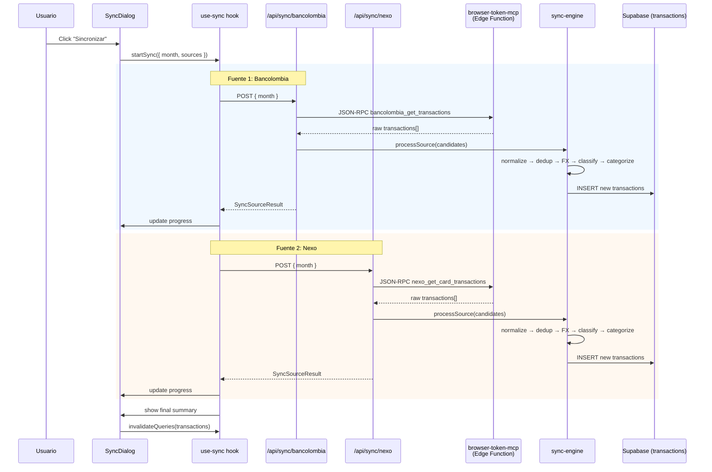

# Design Document — Expense Sync

## Overview

Motor de reconciliación multi-fuente que vive dentro de la app Next.js existente (Vercel). Permite al usuario sincronizar transacciones de un mes seleccionado consultando APIs bancarias (Bancolombia, Nexo Card) a través de la Edge Function `browser-token-mcp`, deduplicando contra transacciones existentes e insertando las nuevas.

**Principio rector:** Under-count — ante la duda, NO crear transacción (marcar `needs_review`).

**Flujo principal:**
1. Usuario abre `/gastos` → presiona "Sincronizar"
2. Sync Dialog: selecciona mes + fuentes
3. Cliente invoca Route Handlers secuencialmente (`/api/sync/bancolombia`, `/api/sync/nexo`)
4. Cada Route Handler: llama MCP → normaliza → dedup → FX → categoriza → insert
5. UI muestra progreso por fuente + resumen final

**Reutilización de módulos existentes:**
- `src/lib/push-ingest/fx.ts` — conversión FX (frankfurter.app)
- `src/lib/push-ingest/categorizer.ts` — reglas de categorización por merchant
- `src/lib/push-ingest/classifier.ts` — clasificación transferencias (allowlist/denylist)
- `src/lib/push-ingest/supabase-admin.ts` — cliente Supabase server-side

---

## Architecture



### Decisiones clave de arquitectura

| Decisión | Razón |
|----------|-------|
| Un Route Handler por fuente | Vercel timeout ~25s. Cada fuente se ejecuta independiente. |
| Orquestación en el cliente | Evita un server-side orchestrator que exceda timeout. El cliente controla secuencia y retry. |
| Reuso de fx.ts / categorizer / classifier | Misma lógica que push-ingest para consistencia de datos. |
| Fuzzy matcher como función pura | Testeable sin I/O. Core del dedup cross-source. |
| No se crean tablas nuevas | Las transacciones van a la tabla `transactions` existente. Se distinguen por `source`. |

---

## Components and Interfaces

### File Structure

```
src/
  app/api/sync/
    bancolombia/route.ts    — Route Handler POST
    nexo/route.ts           — Route Handler POST
    cron/route.ts           — Route Handler GET (Vercel Cron)
  lib/sync/
    types.ts                — Tipos compartidos
    fuzzy-matcher.ts        — Normalización + comparación de merchants
    dedup-sync.ts           — Motor de dedup específico para sync
    adapters/
      bancolombia.ts        — Transform API response → CandidateTransaction[]
      nexo.ts               — Transform API response → CandidateTransaction[]
    sync-engine.ts          — Orchestrator: fetch → normalize → dedup → FX → insert
  components/
    sync-dialog.tsx         — UI dialog
  hooks/
    use-sync.ts             — Mutation hooks
```

### Types (`src/lib/sync/types.ts`)

```typescript
/** Transacción candidata normalizada de cualquier fuente */
export interface CandidateTransaction {
  amount_native: number;
  native_currency: string;      // "COP" | "USD"
  fx_rate_to_usd?: number;      // pre-filled for USD sources
  amount_usd?: number;          // pre-filled for USD sources
  merchant: string | null;
  tx_date: string;              // YYYY-MM-DD
  description_raw: string;
  account_name: string;         // "Bancolombia" | "Nexo Card"
  source: SyncSource;
}

export type SyncSource = "sync_bancolombia" | "sync_nexo";

/** Resultado de dedup para una candidata individual */
export type DedupDecision =
  | { action: "insert" }
  | { action: "insert_review"; reason: string }
  | { action: "discard"; reason: string };

/** Resultado de sincronización por fuente */
export interface SyncSourceResult {
  source: SyncSource;
  found: number;
  inserted: number;
  duplicates: number;
  needs_review: number;
  errors: string[];
}

/** Request body del Route Handler */
export interface SyncRequest {
  month: string; // "YYYY-MM"
}

/** Response body consolidada */
export interface SyncResponse {
  result: SyncSourceResult;
}

/** Error response */
export interface SyncErrorResponse {
  error: string;
  code: "AUTH_EXPIRED" | "MCP_ERROR" | "FX_ERROR" | "DB_ERROR" | "TIMEOUT";
}

/** Parámetros del sync desde el cliente */
export interface SyncParams {
  month: string;
  sources: SyncSource[];
}

/** Estado de progreso en el cliente */
export interface SyncProgress {
  current_source: SyncSource | null;
  completed: SyncSourceResult[];
  errors: Array<{ source: SyncSource; error: string }>;
  status: "idle" | "running" | "done";
}
```

### Fuzzy Matcher (`src/lib/sync/fuzzy-matcher.ts`)

```typescript
/**
 * Normaliza un nombre de comercio para comparación.
 * Transformaciones (en orden):
 * 1. Uppercase
 * 2. Eliminar sufijos corporativos (SA, SAS, S.A., S.A.S., LTDA, COL, S.L.)
 * 3. Eliminar caracteres no alfanuméricos (excepto espacios)
 * 4. Colapsar espacios múltiples
 * 5. Trim
 */
export function normalizeMerchant(raw: string | null): string;

/**
 * Compara dos merchants normalizados.
 * Returns: "match" | "no_match" | "ambiguous"
 * 
 * Reglas:
 * - Iguales → match
 * - Uno es prefijo del otro → match (truncamiento)
 * - Diferencia <= 3 chars (Levenshtein simplificado) → ambiguous
 * - Diferencia > 3 chars sin relación de prefijo → no_match
 */
export function compareMerchants(
  a: string | null,
  b: string | null
): "match" | "no_match" | "ambiguous";
```

### Dedup Engine (`src/lib/sync/dedup-sync.ts`)

```typescript
import type { CandidateTransaction, DedupDecision } from "./types";

/**
 * Evalúa si una candidata es duplicado de alguna transacción existente.
 * 
 * Árbol de decisión:
 * 1. Buscar en `transactions`: mismo amount_native + tx_date + account
 *    → Si match exacto (incluyendo merchant fuzzy) → discard
 *    → Si amount+date match pero merchant difiere → insert_review
 * 2. Buscar en `push_ingest_log`: mismo amount + date + status "registered"
 *    → Si existe → discard (ya capturado por push)
 * 3. Si >1 coincidencia ambigua para mismo monto+fecha → insert_review
 * 4. Sin coincidencia → insert
 */
export async function evaluateCandidate(
  candidate: CandidateTransaction,
  userId: string,
  monthStart: string,
  monthEnd: string
): Promise<DedupDecision>;
```

### Sync Engine (`src/lib/sync/sync-engine.ts`)

```typescript
import type { CandidateTransaction, SyncSourceResult } from "./types";

/**
 * Procesa un batch de candidatas: dedup → FX → classify → categorize → insert.
 * Cada candidata se procesa independientemente (fallo en una no afecta las demás).
 */
export async function processCandidates(
  candidates: CandidateTransaction[],
  userId: string,
  month: string
): Promise<SyncSourceResult>;
```

### Source Adapters

#### Bancolombia Adapter (`src/lib/sync/adapters/bancolombia.ts`)

```typescript
import type { CandidateTransaction } from "../types";

/** Respuesta cruda del MCP bancolombia_get_transactions */
interface BancolombiaRawTx {
  date: string;          // "2024/01/15"
  description: string;
  amount: number;
  type: string;          // "CREDITO" (inflow) | "DEBITO" (outflow) — NOTA: invertido
  office: string;
}

/**
 * Transforma response de MCP → CandidateTransaction[].
 * Filtra solo tipo "CREDITO" (que en la API de Bancolombia = débito/gasto).
 * Nota: la API de Bancolombia invierte la convención: 
 * "CREDITO" = salida de dinero (gasto), "DEBITO" = entrada de dinero.
 */
export function adaptBancolombia(rawTxs: BancolombiaRawTx[]): CandidateTransaction[];
```

#### Nexo Adapter (`src/lib/sync/adapters/nexo.ts`)

```typescript
import type { CandidateTransaction } from "../types";

/** Respuesta cruda del MCP nexo_get_card_transactions */
interface NexoRawTx {
  date: string;           // "2024-01-15"
  merchant: string;
  category: string;
  amount_usd: number;
  amount_local: string;
  local_currency: string;
  cashback_usd: string;
  status: string;
  type: string;
}

/**
 * Transforma response de MCP → CandidateTransaction[].
 * Nexo ya reporta en USD, fx_rate_to_usd = 1.
 */
export function adaptNexo(rawTxs: NexoRawTx[]): CandidateTransaction[];
```

### Route Handler Pattern (`src/app/api/sync/bancolombia/route.ts`)

```typescript
import { NextRequest, NextResponse } from "next/server";

/**
 * POST /api/sync/bancolombia
 * Body: { month: "2024-07" }
 * Auth: Supabase session cookie
 * 
 * Flow:
 * 1. Verify user session
 * 2. Call browser-token-mcp via HTTP POST (JSON-RPC)
 * 3. Adapt response → CandidateTransaction[]
 * 4. Process via sync-engine
 * 5. Return SyncSourceResult
 */
export async function POST(request: NextRequest): Promise<NextResponse>;
```

### MCP Invocation Pattern

```typescript
/**
 * Llama a browser-token-mcp Edge Function via JSON-RPC.
 * URL: NEXT_PUBLIC_SUPABASE_URL/functions/v1/browser-token-mcp
 * Auth: Bearer BROWSER_MCP_SECRET
 */
async function callMcpTool(
  toolName: string,
  params: Record<string, unknown>
): Promise<unknown> {
  const url = `${process.env.NEXT_PUBLIC_SUPABASE_URL}/functions/v1/browser-token-mcp`;
  const response = await fetch(url, {
    method: "POST",
    headers: {
      "Content-Type": "application/json",
      Authorization: `Bearer ${process.env.BROWSER_MCP_SECRET}`,
    },
    body: JSON.stringify({
      jsonrpc: "2.0",
      id: crypto.randomUUID(),
      method: "tools/call",
      params: { name: toolName, arguments: params },
    }),
  });
  
  if (!response.ok) throw new Error(`MCP HTTP ${response.status}`);
  const rpc = await response.json();
  if (rpc.error) throw new Error(rpc.error.message);
  
  // El resultado viene en rpc.result.content[0].text (JSON string)
  return JSON.parse(rpc.result.content[0].text);
}
```

### UI Components

#### Sync Dialog (`src/components/sync-dialog.tsx`)

```typescript
interface SyncDialogProps {
  open: boolean;
  onOpenChange: (open: boolean) => void;
  defaultMonth: string; // "YYYY-MM"
}

/**
 * Dialog modal con:
 * - Select de mes (default: actual)
 * - Checkboxes de fuentes (default: todas checked)
 * - Botón "Iniciar sincronización"
 * - Progress indicator por fuente
 * - Resumen parcial/final
 */
```

#### use-sync Hook (`src/hooks/use-sync.ts`)

```typescript
import type { SyncParams, SyncProgress, SyncSourceResult } from "@/lib/sync/types";

/**
 * Hook que orquesta la ejecución secuencial del sync.
 * Expone: { startSync, progress, reset }
 * 
 * Internamente:
 * - Itera sources en orden
 * - Hace POST a /api/sync/{source}
 * - Acumula resultados en progress
 * - Invalida query de transactions al terminar
 */
export function useSync(): {
  startSync: (params: SyncParams) => Promise<void>;
  progress: SyncProgress;
  reset: () => void;
};
```

---

## Data Models

No se crean tablas nuevas. Se reutiliza el schema existente:

### Tabla `transactions` (campos relevantes para sync)

| Campo | Tipo | Uso en sync |
|-------|------|-------------|
| `id` | uuid (PK) | Auto-generado |
| `user_id` | uuid (FK) | Del usuario autenticado |
| `account_id` | uuid (FK) | Resuelto via `account_name` → `accounts.name` |
| `tx_date` | date | De la candidata |
| `description_raw` | text | Descripción original de la fuente |
| `merchant` | text | Merchant normalizado |
| `amount_native` | numeric | Monto en moneda nativa |
| `native_currency` | text | "COP" / "USD" |
| `fx_rate_to_usd` | numeric | Tasa FX al momento del sync |
| `amount_usd` | numeric | amount_native * fx_rate_to_usd |
| `category_id` | uuid (FK, nullable) | Auto-categorizado o null |
| `is_payment` | boolean | true si clasificado como transferencia |
| `needs_review` | boolean | true si dedup ambiguo o sin categoría |
| `source` | text | "sync_bancolombia" / "sync_nexo" |
| `country` | text | "CO" por default |
| `expense_type` | text | "variable" por default |

### Tabla `push_ingest_log` (consultada para dedup)

| Campo | Uso en sync |
|-------|-------------|
| `dedup_key` | PK — se consulta para verificar si push ya capturó |
| `amount_native` | Comparación de monto |
| `status` | Filtrar por "registered" |
| `created_at` | Filtrar por rango de mes |

### Tabla `accounts` (lookup)

| Campo | Uso en sync |
|-------|-------------|
| `id` | Para resolver account_id |
| `name` | Match con `candidate.account_name` |

---


## Correctness Properties

*A property is a characteristic or behavior that should hold true across all valid executions of a system — essentially, a formal statement about what the system should do. Properties serve as the bridge between human-readable specifications and machine-verifiable correctness guarantees.*

### Property 1: Bancolombia Adapter Transformation

*For any* valid Bancolombia API response containing transactions, `adaptBancolombia` SHALL produce only `CandidateTransaction` items where: (a) only outflows (type "CREDITO") are included, (b) `source` is always `"sync_bancolombia"`, (c) `native_currency` is always `"COP"`, (d) `account_name` is always `"Bancolombia"`, and (e) `amount_native` > 0.

**Validates: Requirements 3.2, 3.3, 3.5**

### Property 2: Nexo Adapter Transformation

*For any* valid Nexo MCP response containing card transactions, `adaptNexo` SHALL produce only `CandidateTransaction` items where: (a) `source` is always `"sync_nexo"`, (b) `native_currency` is always `"USD"`, (c) `fx_rate_to_usd` is always `1`, (d) `amount_usd` equals `amount_native`, and (e) `account_name` is always `"Nexo Card"`.

**Validates: Requirements 4.2, 4.4**

### Property 3: Merchant Normalization Idempotence

*For any* merchant string, applying `normalizeMerchant` twice SHALL produce the same result as applying it once: `normalizeMerchant(normalizeMerchant(s)) === normalizeMerchant(s)`.

**Validates: Requirements 6.1**

### Property 4: Merchant Comparison Correctness

*For any* two merchant strings `a` and `b`, after normalization: (a) if normalized forms are identical, `compareMerchants` returns `"match"`; (b) if one normalized form is a prefix of the other, `compareMerchants` returns `"match"`; (c) if normalized forms differ by more than 3 characters and neither is a prefix of the other, `compareMerchants` returns `"no_match"`.

**Validates: Requirements 6.2, 6.3, 6.4**

### Property 5: Dedup Decision Tree — Under-count Safety

*For any* `CandidateTransaction` and set of existing transactions in the same month: (a) if an existing transaction has same `amount_native` + `tx_date` + same account AND merchant fuzzy-matches → decision is `"discard"`; (b) if same amount + date but merchant does NOT match → decision is `"insert_review"`; (c) if more than one ambiguous match exists for same amount+date → decision is `"insert_review"` (never `"insert"`); (d) if no match at all → decision is `"insert"`. The system SHALL never produce `"insert"` when any ambiguous match exists.

**Validates: Requirements 5.2, 5.3, 5.4, 5.5, 5.7, 13.1, 13.2, 13.3, 13.4, 13.5**

### Property 6: FX Assignment Correctness

*For any* `CandidateTransaction`: (a) if `native_currency` is `"USD"`, then `fx_rate_to_usd` SHALL be `1` and `amount_usd` SHALL equal `amount_native`; (b) if `native_currency` is NOT `"USD"`, then `amount_usd` SHALL equal `round(amount_native * fx_rate_to_usd, 4)` and `fx_rate_to_usd` SHALL be > 0.

**Validates: Requirements 7.2, 7.3, 7.4**

### Property 7: Candidate Failure Isolation

*For any* batch of N candidates where K candidates fail processing (FX failure, categorization error, etc.), the remaining N-K candidates SHALL still be processed and inserted successfully. A failure in one candidate SHALL NOT prevent other candidates from being processed.

**Validates: Requirements 12.1, 12.2, 12.4**

---

## Error Handling

### Por capa

| Capa | Error | Acción |
|------|-------|--------|
| MCP call | Token expirado (401/403) | Retornar `SyncErrorResponse` con `code: "AUTH_EXPIRED"` + mensaje para renovar sesión |
| MCP call | Timeout (15s) | Retornar `SyncErrorResponse` con `code: "TIMEOUT"` |
| MCP call | Otro error HTTP | Retornar `SyncErrorResponse` con `code: "MCP_ERROR"` |
| Adapter | Response no parseable | Log + skip source, reportar en errors[] |
| FX service | Timeout o error | Skip candidata individual, agregar a errors[] |
| Dedup | DB query falla | Tratar como "no match" (fail open → insertará, pero mejor que perder dato) |
| Categorizer | DB query falla | Insertar con `category_id = null`, `needs_review = true` |
| INSERT | Supabase error | Skip candidata, agregar a errors[] |
| Route Handler | Excede timeout Vercel | El cliente recibe error de red, marca source como fallida |
| Cron | Auth inválida | HTTP 401, no ejecutar sync |

### Estrategia de resiliencia

1. **Granularidad de error:** Cada candidata se procesa independientemente. Un fallo en una NO afecta las demás.
2. **Partial success:** El Route Handler siempre retorna `SyncSourceResult` (incluso con 0 insertions) o `SyncErrorResponse`. HTTP 200 para éxito parcial, HTTP 207 para multi-status.
3. **Client continuity:** Si un Route Handler falla, el hook `use-sync` continúa con la siguiente fuente.
4. **No rollback:** Las transacciones insertadas antes de un fallo se mantienen. No hay rollback de batch parcial.

### Mensajes de error para el usuario (en español)

```typescript
const ERROR_MESSAGES: Record<string, string> = {
  AUTH_EXPIRED: "La sesión bancaria expiró. Abrí Bancolombia/Nexo en el navegador y volvé a intentar.",
  MCP_ERROR: "Error al consultar la fuente. Intentá de nuevo en unos minutos.",
  TIMEOUT: "La consulta tardó demasiado. Intentá de nuevo.",
  FX_ERROR: "No se pudo obtener la tasa de cambio. Algunas transacciones no se procesaron.",
  DB_ERROR: "Error al guardar las transacciones. Intentá de nuevo.",
};
```

---

## Testing Strategy

### Enfoque dual: Unit tests + Property-based tests

**Framework:** Vitest + [fast-check](https://github.com/dubzzz/fast-check) para PBT.

### Property-Based Tests (7 properties)

Cada property test usa `fast-check` con mínimo 100 iteraciones y tag referenciando la propiedad del diseño.

| Property | Módulo bajo test | Generadores necesarios |
|----------|-----------------|----------------------|
| P1: Bancolombia adapter | `adapters/bancolombia.ts` | `Arbitrary<BancolombiaRawTx[]>` con tipos mixtos |
| P2: Nexo adapter | `adapters/nexo.ts` | `Arbitrary<NexoRawTx[]>` con montos y merchants random |
| P3: Normalization idempotence | `fuzzy-matcher.ts` | `fc.string()` (cualquier string) |
| P4: Merchant comparison | `fuzzy-matcher.ts` | Pares de strings con relaciones controladas (prefijos, diferentes) |
| P5: Dedup decision tree | `dedup-sync.ts` | `Arbitrary<CandidateTransaction>` + `Arbitrary<ExistingTransaction[]>` |
| P6: FX assignment | `sync-engine.ts` | `Arbitrary<CandidateTransaction>` con currencies variadas |
| P7: Failure isolation | `sync-engine.ts` | `Arbitrary<CandidateTransaction[]>` + failure injection |

**Configuración por test:**

```typescript
// Ejemplo de tag para referencia a la property
// Feature: expense-sync, Property 3: Merchant Normalization Idempotence
it.prop([fc.string()], { numRuns: 100 })(
  "normalization is idempotent",
  (merchant) => {
    const once = normalizeMerchant(merchant);
    const twice = normalizeMerchant(once);
    expect(twice).toBe(once);
  }
);
```

### Unit Tests (example-based)

| Área | Tests |
|------|-------|
| `fuzzy-matcher.ts` | Casos concretos: "PERGAMINO VIVA ENVIGAD" vs "PERGAMINO VIVA ENVIGADO SA" → match |
| `dedup-sync.ts` | Escenario: 2 transacciones mismo monto/fecha, solo 1 merchant match → descartar solo esa |
| `adapters/*.ts` | Parseo de respuestas reales (fixtures JSON capturados de la API) |
| `sync-engine.ts` | Flow completo mockeado: candidata nueva → inserted |
| Route Handlers | Auth verification, error responses |
| `use-sync.ts` | Sequential execution, progress state transitions |
| `sync-dialog.tsx` | Render con defaults, interaction flow |

### Integration Tests

| Escenario | Qué verifica |
|-----------|-------------|
| MCP call real (staging) | JSON-RPC payload correcto, response parsing |
| DB round-trip | Insert + query back, verify fields |
| Cron auth | Bearer token validation |

### Test file structure

```
src/lib/sync/__tests__/
  fuzzy-matcher.test.ts        — P3, P4 + unit examples
  fuzzy-matcher.property.test.ts — PBT only
  dedup-sync.test.ts           — P5 + unit examples
  adapters/bancolombia.test.ts — P1 + fixture tests
  adapters/nexo.test.ts        — P2 + fixture tests
  sync-engine.test.ts          — P6, P7 + integration mocks
```
