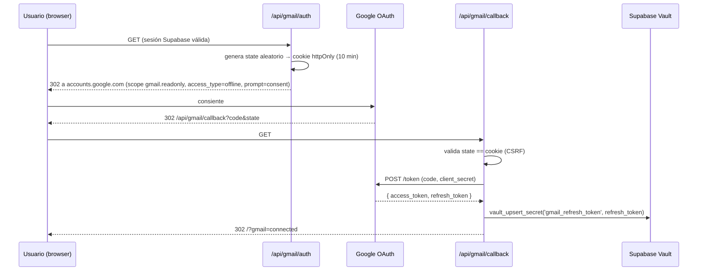
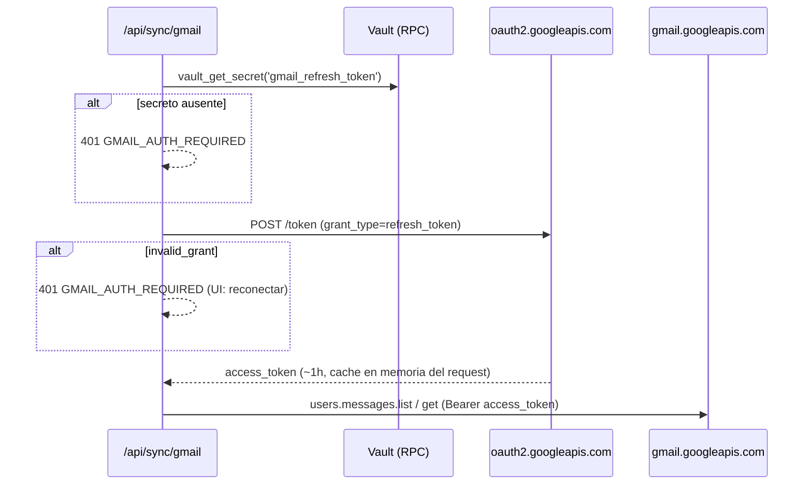

# Gmail Expense Sync — Design

## 1. Overview

Gmail se integra como **tercera familia de fuentes** del sync engine existente. La novedad es exclusivamente la capa de adquisición (OAuth + Gmail API + parsers de email); todo lo demás (dedup, FX, clasificación, categorización, insert, UI de progreso) se reutiliza.

```
                 ┌─────────────────────────────────────────────┐
                 │           YA EXISTE (se reutiliza)           │
 Gmail API ──▶ parsers ──▶ CandidateTransaction[] ──▶ processCandidates()
                 │             │                        ├─ evaluateCandidate (dedup-sync + fuzzy-matcher)
                 │             │                        ├─ resolveRate / calculateUsd (fx)
                 │             │                        ├─ classifyTransaction (transfer rules)
                 │             │                        ├─ categorize (merchant rules)
                 │             │                        └─ insert → transactions
                 └─────────────────────────────────────────────┘
```

### Decisiones resueltas (preguntas del pedido)

| Pregunta | Decisión | Por qué |
|---|---|---|
| ¿Dónde hacer el OAuth flow? | Redirect-based en la app, one-time: `/api/gmail/auth` → consent → `/api/gmail/callback`. | Una sola autenticación; el refresh token (con `access_type=offline` + `prompt=consent`) dura indefinidamente. Sin setup manual de tokens. |
| ¿PDF parsing en Vercel? | **No aplica en v1.** RappiCard no adjunta PDF (notificaciones por transacción cubren todo); BBVA no adjunta PDF (link detrás de login) → fuera de alcance v1. | Verificado contra el Gmail real. Si aparece una fuente con PDF: `unpdf` (text extraction, sin binarios nativos) entra en el timeout para extractos chicos. |
| ¿Cómo trackear emails procesados? | `push_ingest_log` con `dedup_key = sha256("gmail|" + message_id)[0..32]`, `package_name = "gmail.<source>"`. Sin labels. | Cero tablas nuevas, idempotencia a nivel DB (PK), scope Gmail se mantiene `readonly`. |
| ¿Batching? | Listar IDs del mes → filtrar ya-procesados en 1 query → bajar bodies en chunks de ~20 → `processCandidates` por sub-fuente. Cursor de reanudación si se acerca el timeout. | El dedup incremental por email ya lo da la PK; el chunking protege el límite de ~25s. |
| ¿Refresh token: Vault o tabla con RLS? | **Vault** (`vault.secrets`), accedido vía RPCs `SECURITY DEFINER` solo para service role. | Vault ya está habilitado (migración `20260101000003`). Cifrado at-rest, jamás expuesto a PostgREST/cliente. |

## 2. Formatos reales de email (evidencia)

Capturados del Gmail del usuario (2026-06). Los fixtures de tests salen de acá.

### Bancolombia — `alertasynotificaciones@an.notificacionesbancolombia.com`

El body (existe parte `text/plain`) contiene una oración transaccional. Variantes observadas:

```
COMPRA      "Bancolombia: Compraste $7.500,00 en PERGAMINO VIVA ENVIG con tu T.Deb *5685, el 09/06/2026 a las 15:29."
PAGO        "Pagaste $359702.00 a EMPRESAS PUBLICAS DE MEDELLIN desde tu producto 9898 el 06/06/2026 02:41:55."
QR/BRE-B    "PATRICIO ... pagaste $25000.00 por codigo QR desde tu cuenta *9898 a la llave 0073300683 el 06/06/2026 a las 13:12."
BRE-B LLAVE "PATRICIO, transferiste $3000.00 a la llave @nancy8833 desde tu cuenta *9898 a NANCY BEATRIZ HENAO HENAO el 25/05/26 a las 16:17."
TRANSFER    "Transferiste $100000 desde tu cuenta *9898 a la cuenta *34238965219 el 08/06/2026 a las 13:56."
BOTON       "Transferiste $1900000.00 por Boton Bancolombia a PALOMMA SAS desde producto *9898. 01/06/2026 17:48:13."
INGRESO ✗   "PATRICIO, recibiste una transferencia de SUPRA NEGOCIOS SAS por $970000.00 ..."   → skip
INGRESO ✗   "Recibiste un pago PROVEEDOR de PEXTO COLOMBIA por $5850000.00 ..."               → skip
NO-TX  ✗    "¡Te interesa! Tenemos novedades ... La factura que inscribiste EPM ... está lista" → skip
```

Montos en **tres formatos**: `$7.500,00` / `$359702.00` / `$100000`. Fechas `DD/MM/YYYY` y `DD/MM/YY`. La lógica `parseCopAmount` + `normalizeDate` de `src/lib/push-ingest/parsers/bancolombia.ts` ya resuelve ambas y se extrae a un módulo compartido.

> Nota: el patrón QR del email difiere del de la push notification (`pagaste $X por codigo QR desde tu cuenta *N a la llave NNN` — sin merchant). El parser de email necesita su propio set de regex; no se reutilizan las del push parser, sí sus helpers de monto/fecha.

### RappiCard — `noreply@rappicard.co`, subject "RappiCard - Resumen de transacción"

Solo HTML (sin parte text/plain). Tras strip de tags:

```
"Realizaste una compra con tu RappiCard. Detalle de tu transacción:
 Monto $88.443  Método de pago *3679  No. de autorización 313098  Comercio RAPPI  Fecha de la transacción <fecha>"
```

`Monto` en formato CO sin decimales observado (`$88.443` = 88 443 COP). El formato exacto del campo Fecha debe confirmarse con el fixture real en la primera tarea de implementación (el HTML es muy pesado, ~90KB por email); fallback: fecha del header `Date` del mensaje (mismo día, zona `America/Bogota`).

Emails del mismo remitente a ignorar: "¡Llegó el extracto de tu RappiCard!" (sin PDF), "Reporte de costos anual", marketing.

### Arriendo — `info@palomma.com`, subject "Confirmación de Pago"

HTML estructurado tipo tabla:

```
N. de transacción: 01KT2NW9TDHYFEMC7KY1A0JETS   Fecha: 01/06/2026
¡PAGO APROBADO!
Arrendatario: DANDREA ESCODA PATRICIO EDUARDO
Descripción del pago: Canon Inmueble TV 32A SUR 31 E 47 AP 201
N. referencia: 010863808323
Estado: Aprobado
Método de pago: Cuenta Bancolombia
Valor total: $ 1.900.000
```

⚠️ El mismo pago genera el email Bancolombia "Transferiste $1900000.00 por Boton Bancolombia a PALOMMA SAS" (mismo monto, misma fecha). Ver §6 dedup.

### BBVA — `avisos@bbva.com.ar` (fuera de alcance v1)

"Ya podes descargar tu resumen de tarjeta Visa/Mastercard BBVA": **sin adjunto**, solo link tokenizado `https://online.bbva.com.ar/descarga-resumen/...` (requiere sesión). Existen avisos "TRANSFERENCIA INMEDIATA DEBITADA/ACREDITADA" estructurados que podrían ser fuente parcial en v2 (moneda ARS).

## 3. Estructura de archivos

```
src/lib/sync/
  types.ts                      [MODIFICAR] SyncSource += gmail sources; tipos de cursor
  gmail/
    types.ts                    [NUEVO] GmailSourceDef, GmailMessage, GmailSyncCursor
    token-store.ts              [NUEVO] get/store refresh token (Vault RPCs)
    client.ts                   [NUEVO] Gmail REST client: refresh, list, get
    html-to-text.ts             [NUEVO] strip HTML → texto plano normalizado
    money.ts                    [NUEVO] parseCopAmount + normalizeDate (extraídos de push-ingest)
    orchestrator.ts             [NUEVO] runGmailSource(): list → filter procesados → parse → processCandidates → log → close item
    sources/
      index.ts                  [NUEVO] registry: GMAIL_SOURCES (orden de ejecución)
      bancolombia.ts            [NUEVO] query + parser
      rappicard.ts              [NUEVO] query + parser
      arriendo.ts               [NUEVO] query + parser
src/app/api/gmail/auth/route.ts       [NUEVO] inicia OAuth
src/app/api/gmail/callback/route.ts   [NUEVO] guarda refresh token en Vault
src/app/api/gmail/status/route.ts     [NUEVO] GET → { connected: boolean }
src/app/api/sync/gmail/route.ts       [NUEVO] POST { month, sources?, cursor? }
src/app/api/sync/cron/route.ts        [MODIFICAR] agrega paso Gmail
src/hooks/use-sync.ts                 [MODIFICAR] endpoint gmail + loop de cursor
src/components/sync-dialog.tsx        [MODIFICAR] checkbox Gmail + sub-resultados + CTA conectar
supabase/migrations/20260101000009_gmail_vault_rpc.sql  [NUEVO]
```

Convención AGENTS.md: antes de tocar route handlers/proxy, leer las guías de `node_modules/next/dist/docs/` (Next 16 tiene breaking changes).

## 4. Tipos e interfaces

```ts
// src/lib/sync/types.ts (modificación)
export type SyncSource =
  | "sync_bancolombia"
  | "sync_nexo"
  | "sync_gmail_bancolombia"
  | "sync_gmail_rappicard"
  | "sync_gmail_arriendo";

export type SyncErrorCode =
  | "AUTH_EXPIRED" | "MCP_ERROR" | "FX_ERROR" | "DB_ERROR" | "TIMEOUT"
  | "GMAIL_AUTH_REQUIRED"   // refresh token ausente/revocado → CTA reconectar
  | "GMAIL_API_ERROR";      // 4xx/5xx de la Gmail API

// src/lib/sync/gmail/types.ts
export type GmailSourceId = "bancolombia" | "rappicard" | "arriendo";

/** Una fuente Gmail = query + parser. Agregar fuente nueva = un archivo nuevo. */
export interface GmailSourceDef {
  id: GmailSourceId;
  syncSource: SyncSource;          // p.ej. "sync_gmail_bancolombia"
  accountName: string;             // debe existir en accounts
  closeItemSource: string | null;  // match contra monthly_close_items.source ("Bancolombia", "Arriendo")
  buildQuery(month: string): string;             // Gmail search query con after/before
  parse(email: ParsedEmail): CandidateTransaction[];  // [] = descartar (under-count)
}

export interface ParsedEmail {
  messageId: string;
  internalDate: string;   // epoch ms del mensaje (fallback de tx_date)
  subject: string;
  bodyText: string;       // text/plain si existe; si no, html-to-text(htmlBody)
}

export interface GmailSyncCursor {
  source: GmailSourceId;
  pageToken?: string;
}

export interface GmailSyncResponse {
  results: SyncSourceResult[];     // parciales o completos, por sub-fuente
  next: GmailSyncCursor | null;    // null = mes completo
}
```

`CandidateTransaction` no cambia. La única extensión al engine es la unión `SyncSource` (y `expense_type` fijo para arriendo, ver §6.3).

## 5. OAuth y manejo de tokens

### Flow (one-time)



### Acceso runtime



### Vault (migración `20260101000009`)

`vault` no está expuesto por PostgREST, así que el acceso es vía RPCs en `public`:

```sql
create or replace function public.vault_upsert_secret(p_name text, p_secret text)
returns void language plpgsql security definer set search_path = '' as $$
begin
  if exists (select 1 from vault.secrets where name = p_name) then
    perform vault.update_secret((select id from vault.secrets where name = p_name), p_secret);
  else
    perform vault.create_secret(p_secret, p_name);
  end if;
end $$;

create or replace function public.vault_get_secret(p_name text)
returns text language sql security definer set search_path = '' as $$
  select decrypted_secret from vault.decrypted_secrets where name = p_name;
$$;

revoke execute on function public.vault_upsert_secret(text, text) from public, anon, authenticated;
revoke execute on function public.vault_get_secret(text) from public, anon, authenticated;
grant  execute on function public.vault_upsert_secret(text, text) to service_role;
grant  execute on function public.vault_get_secret(text) to service_role;
```

Nombre del secreto: `gmail_refresh_token` (app single-user; si algún día hay multiusuario, sufijo `_<user_id>`).

Env vars nuevas: `GOOGLE_CLIENT_ID`, `GOOGLE_CLIENT_SECRET`, `GOOGLE_OAUTH_REDIRECT_URI` (p.ej. `https://<app>.vercel.app/api/gmail/callback`).

### Cliente Gmail (`client.ts`)

REST puro con `fetch` (sin SDK `googleapis`, que pesa ~10MB y no aporta en serverless):

- `refreshAccessToken(): Promise<string>` — POST `oauth2.googleapis.com/token`; mapea `invalid_grant` → `GmailAuthError`.
- `listMessageIds(q, pageToken?)` — `GET /gmail/v1/users/me/messages?q=...&maxResults=100`.
- `getMessage(id)` — `GET .../messages/{id}?format=full`; decodifica base64url; devuelve `ParsedEmail` (prefiere parte `text/plain`, si no `html-to-text(text/html)`).
- Timeout 10s por llamada (AbortController, mismo patrón que `mcp-client.ts`); 429/5xx → un retry con backoff 1s, después error.

## 6. Pipeline de sincronización

### Orquestador (`orchestrator.ts`)

```
runGmailMonth(month, sources, cursor?, budgetMs≈20000):
  para cada sourceDef en GMAIL_SOURCES (orden fijo: arriendo → rappicard → bancolombia):
    1. ids = listMessageIds(sourceDef.buildQuery(month))           [paginado]
    2. nuevos = ids - ya procesados                                 [1 query: dedup_key IN (...)]
    3. por chunk de 20 mensajes (mientras quede presupuesto de tiempo):
        a. email = getMessage(id)
        b. candidates = sourceDef.parse(email)
        c. si [] → log push_ingest_log (status según motivo) y seguir
        d. processCandidates(candidates, userId, month)             [engine existente]
        e. log push_ingest_log status=registered/duplicate (uno por email)
    4. si se agotó el presupuesto → return { results parciales, next: { source, pageToken } }
    5. si la sub-fuente terminó sin errores y closeItemSource ≠ null → marcar monthly_close_item 'cargado'
  return { results, next: null }
```

**Orden de fuentes**: `arriendo` corre primero a propósito — así la confirmación de Palomma (metadata rica, `expense_type: "fixed"`) entra antes de que el email Bancolombia "Transferiste … a PALOMMA SAS" llegue al dedup, donde cae en `same_amount_date_different_merchant → insert_review` o queda neutralizado por la regla allowlist `PALOMMA` (seed en la migración: `transfer_classification_rules` con pattern `PALOMMA`, list_type `allowlist` → `is_payment = true`, no computa gasto).

### Idempotencia (capa nueva, encima del engine)

- `dedup_key = sha256("gmail|" + messageId).slice(0, 32)` — determinístico, PK de `push_ingest_log`.
- Estados reutilizados del CHECK constraint existente: `registered` (insertado), `duplicate` (dedup lo descartó o re-run), `no_parser` (no transaccional / parse fallido, motivo en `error_message`), `transfer` (ingreso o transferencia pura), `registration_failed`.
- El filtro previo (paso 2) hace el re-run barato: re-correr un mes ya cargado = 1 list + 1 query, 0 gets.

### Dedup cross-fuente (capa existente)

`evaluateCandidate` ya cubre los tres choques posibles:

| Choque | Resultado |
|---|---|
| Email Bancolombia vs push notification ya registrada (mismo monto+fecha, merchant fuzzy-match: "PERGAMINO VIVA ENVIG" ≈ "PERGAMINO VIVA ENVIG") | `discard` |
| Email RappiCard vs gasto manual del mismo monto+fecha, merchant distinto | `insert_review` (under-count: se inserta pero marcado) |
| Email Arriendo (merchant "Arriendo") vs transferencia Bancolombia ("PALOMMA SAS") | el de arriendo entra primero; el de Bancolombia → `insert_review` + allowlist lo marca `is_payment` |

### `expense_type` para arriendo

`processCandidates` hardcodea `expense_type: "variable"`. Cambio mínimo en el engine: `CandidateTransaction` gana un campo opcional `expense_type?: "fixed" | "variable"` (default `"variable"`), que el insert respeta. Es la única modificación de comportamiento al engine existente.

## 7. Route Handlers

### `POST /api/sync/gmail`

```ts
// Request
{ month: "2026-06", sources?: ["bancolombia","rappicard","arriendo"], cursor?: GmailSyncCursor }
// Response 200
{ results: SyncSourceResult[], next: GmailSyncCursor | null }
// Errores: 401 {code:"AUTH_EXPIRED"} (sesión) | 401 {code:"GMAIL_AUTH_REQUIRED"} | 400 mes inválido | 502 {code:"GMAIL_API_ERROR"}
```

Mismo esqueleto que `/api/sync/bancolombia/route.ts` (verificar sesión Supabase → validar month → orquestar → responder). El presupuesto de tiempo se mide con `Date.now()` desde el inicio del request; al superarlo se corta limpio y se devuelve `next`.

### `use-sync.ts` (cliente)

`sync_gmail` se agrega a `SOURCE_ENDPOINTS` con manejo especial: hace POST en loop mientras `next !== null`, re-enviando el cursor; acumula los `SyncSourceResult` parciales por sub-fuente en `progress.completed` (merge por `source`). El resto del hook no cambia.

### Cron (`/api/sync/cron`)

Después de los pasos Bancolombia/Nexo existentes, agrega un paso Gmail: itera `runGmailMonth` (con loop de cursor server-side, el cron no tiene UI). Si `now.getDate() <= 5`, corre también el mes anterior (Req 9.4). Errores van al array `errors` existente. Registrar el schedule en `vercel.json` (`crons`) si aún no existe.

## 8. UI (SyncDialog)

- `SOURCES` gana `{ id: "sync_gmail", label: "Gmail" }` como fuente seleccionable de primer nivel.
- Al abrir el dialog, `GET /api/gmail/status`; si `connected: false`, el checkbox se reemplaza por botón "Conectar Gmail" → `window.location = "/api/gmail/auth"`.
- Durante el run, los resultados parciales de Gmail se renderizan como sub-filas: "Gmail · Bancolombia — 42 encontradas · 3 nuevas · 39 duplicados". Reutiliza `SourceResult` con labels `"Gmail · <Fuente>"`.
- Textos en español (convención del proyecto).

## 9. Error handling

| Falla | Detección | Comportamiento | Código |
|---|---|---|---|
| Refresh token ausente/revocado | Vault vacío o `invalid_grant` | 401, UI muestra CTA reconectar | `GMAIL_AUTH_REQUIRED` |
| Gmail API 429/5xx | status code | 1 retry con backoff; luego aborta la sub-fuente, las demás siguen | `GMAIL_API_ERROR` |
| Email no parseable | parser devuelve `[]` | log `no_parser` + motivo; **nunca** insert con datos inventados | — |
| FX caído | `resolveRate` not ok | comportamiento existente del engine: skip + error en resultado | `FX_ERROR` |
| Cuenta inexistente | lookup `accounts` falla | sub-fuente reporta error, no aborta el run | `DB_ERROR` |
| Timeout Vercel inminente | presupuesto 20s agotado | corte limpio + cursor `next` | (200 parcial) |
| Insert falla | error de Supabase | contabilizado en `errors[]` del resultado (engine existente) | `DB_ERROR` |
| `monthly_close_item` ausente | query vacía | continuar silencioso (cierre opcional) | — |

Principio transversal: un email problemático afecta solo a ese email; una sub-fuente caída afecta solo a esa sub-fuente.

## 10. Seguridad

- Scope mínimo: `gmail.readonly`. Sin labels, sin escritura.
- Refresh token: solo en Vault, RPCs solo-service-role, jamás serializado a respuestas ni logs.
- `state` CSRF en OAuth (cookie httpOnly, SameSite=Lax, TTL 10 min).
- Route handlers de sync: sesión Supabase (igual que los existentes); cron: `SYNC_CRON_SECRET`.
- Bodies de email: solo se persiste `description_raw` (la oración transaccional), no el email completo.
- `client_secret` de Google solo en env vars de Vercel.

## 11. Testing strategy

Vitest (config existente). Fixtures: bodies reales sanitizados en `src/lib/sync/gmail/__fixtures__/*.txt|html`.

### Unit tests con fixtures (por parser)

- Bancolombia: 1 test por variante de la tabla §2 (compra, pago, QR, Bre-b, transferencia, botón, ingreso→[], factura→[]).
- RappiCard: resumen de transacción → 1 candidato; email de extracto → []; marketing → [].
- Arriendo: aprobado → 1 candidato `expense_type: fixed`; no aprobado → [].

### Property-based tests (propiedades del sistema)

1. **Parsers totales y honestos**: ∀ string (incluyendo basura/HTML malformado), `parse()` no lanza y devuelve `[]` o candidatos con `amount_native > 0`, `tx_date` matching `/^\d{4}-\d{2}-\d{2}$/` y `native_currency` no vacío. (Under-count: nunca un candidato con monto 0/NaN.)
2. **Montos CO**: ∀ entero n > 0, `parseCopAmount(formatCO(n)) === n` para los tres formatos (`1.234,56`, `1234.56`, `1234`); y `parseCopAmount` nunca devuelve NaN para inputs `$[\d.,]+`.
3. **Fechas**: ∀ fecha válida, `normalizeDate("DD/MM/YY") === normalizeDate("DD/MM/YYYY")` y el resultado es ISO parseable.
4. **Idempotencia del dedup_key**: ∀ messageId, `gmailDedupKey(id)` es determinístico, 32 hex chars, e inyectivo para ids distintos (colisión solo por hash).
5. **Idempotencia end-to-end** (integration, con Supabase mockeado): procesar la misma lista de emails dos veces → segunda corrida `inserted === 0`.
6. **Fuzzy dedup conmutativo**: ya cubierto por `fuzzy-matcher`; agregar caso "PALOMMA SAS" vs "Arriendo" → `no_match` (documenta el comportamiento esperado del choque arriendo).

### Manual/E2E checklist (post-deploy)

1. Conectar Gmail → secreto aparece en Vault.
2. Sync junio 2026 → comparar contra los emails reales del mes (conteo por sub-fuente).
3. Re-sync inmediato → 0 nuevas.
4. Revocar acceso en Google Account → sync devuelve CTA reconectar.
