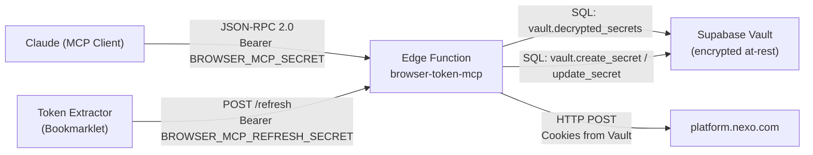
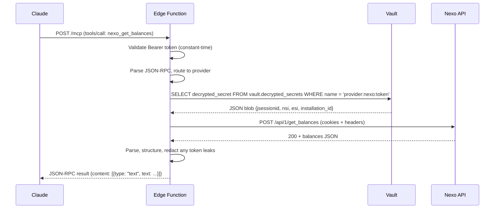
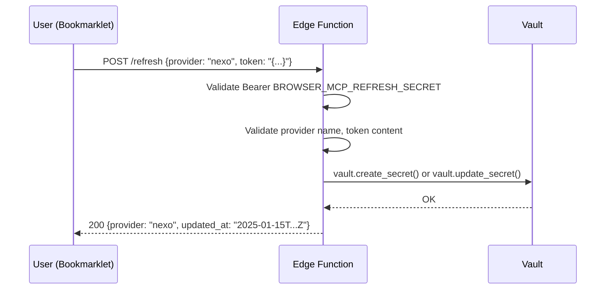

# Design Document: Browser Token MCP

## Overview

A generic MCP server deployed as a Supabase Edge Function that enables Claude to access platforms without official APIs (starting with Nexo) by using browser-extracted session tokens. The architecture implements a two-layer authentication model:

1. **Claude → MCP**: Stable shared secret (`BROWSER_MCP_SECRET`)
2. **MCP → Provider**: Volatile session tokens stored encrypted in Supabase Vault

The server is strictly **read-only** — no tool can move money or modify account state.

### Key Design Decisions

| Decision | Rationale |
|----------|-----------|
| Cookie-based auth for Nexo (not Bearer) | Nexo's internal API uses `JSESSIONID` + `nsi` + `esi` cookies, confirmed via DevTools |
| Session token = JSON blob with cookies + installation_id | Multiple cookies + header values needed; stored as single JSON object |
| `correlationid` generated per request | Random UUID per call, matches observed browser behavior |
| Skip `__cf_bm` Cloudflare cookie | Rotates too frequently; API works without it based on testing |
| Separate refresh secret from MCP secret | Defense in depth — bookmarklet auth ≠ Claude auth |
| Single Edge Function with path-based routing | Simpler deployment; `/mcp` for JSON-RPC, `/refresh` for token push |
| No token caching in memory | Always read fresh from Vault per request for correctness |

## Architecture

### High-Level System Diagram



### Request Flow — Tool Invocation



### Request Flow — Token Refresh



## Components and Interfaces

### Low-Level Module Structure

```
supabase/functions/browser-token-mcp/
├── index.ts              # Entry point: HTTP routing, auth, CORS
├── mcp.ts                # JSON-RPC dispatcher, MCP protocol handling
├── refresh.ts            # Token refresh endpoint handler
├── vault.ts              # Vault read/write abstraction
├── registry.ts           # Provider module registry
├── security.ts           # Constant-time compare, token redaction
├── types.ts              # Shared TypeScript interfaces
└── providers/
    └── nexo.ts           # Nexo provider module
```

### Component Interfaces

#### `types.ts` — Shared Interfaces

```typescript
/** Stored in Vault as JSON string for Nexo */
interface NexoSessionToken {
  jsessionid: string;
  nsi: string;
  esi: string;
  installation_id: string;
}

/** Generic interface for all provider modules */
interface ProviderModule {
  /** Unique provider name (lowercase, matches vault key) */
  name: string;
  /** Tools this provider exposes */
  tools: ToolDefinition[];
  /** Execute a tool with given params and session token */
  handle(toolName: string, params: Record<string, unknown>, token: string): Promise<ToolResult>;
}

interface ToolDefinition {
  name: string;
  description: string;
  inputSchema: JsonSchema;
}

interface ToolResult {
  content: Array<{ type: "text"; text: string }>;
  isError?: boolean;
}

interface RefreshRequest {
  provider: string;
  token: string;
}

interface RefreshResponse {
  provider: string;
  updated_at: string; // ISO 8601 UTC
}
```

#### `index.ts` — Entry Point (Router)

```typescript
// Responsibilities:
// 1. CORS preflight handling (OPTIONS → 204)
// 2. Method validation (non-POST/OPTIONS → 405)
// 3. Path routing: /refresh → refreshHandler, default → mcpHandler
// 4. Auth validation per path (different secrets)

Deno.serve(async (req: Request): Promise<Response> => {
  // OPTIONS → 204 + CORS
  // Method check → 405 if not POST/OPTIONS
  // Route: URL path ends with "/refresh" → refreshHandler
  // Default route → mcpHandler (JSON-RPC)
});
```

#### `mcp.ts` — MCP Protocol Handler

```typescript
// Responsibilities:
// 1. Validate BROWSER_MCP_SECRET (constant-time)
// 2. Parse JSON body (→ -32700 on failure)
// 3. Handle JSON-RPC methods: initialize, tools/list, tools/call, ping
// 4. Dispatch tools/call to registry
// 5. Wrap provider errors in consistent MCP error structure

export async function mcpHandler(req: Request): Promise<Response>;
```

#### `refresh.ts` — Token Refresh Handler

```typescript
// Responsibilities:
// 1. Validate BROWSER_MCP_REFRESH_SECRET (constant-time)
// 2. Validate Content-Type is application/json (→ 415)
// 3. Parse body (→ 400 if > 10KB or invalid JSON)
// 4. Validate provider name against registry (→ 400 if unknown)
// 5. Validate token field (not empty/whitespace, ≤ 8192 chars)
// 6. Store token in Vault
// 7. Return 200 with confirmation

export async function refreshHandler(req: Request): Promise<Response>;
```

#### `vault.ts` — Vault Abstraction

```typescript
// Responsibilities:
// 1. Read token: query vault.decrypted_secrets by name
// 2. Write token: upsert via vault.create_secret / vault.update_secret
// 3. Handle errors (not found vs service failure)
// 4. Enforce 5-second timeout on reads

export async function readToken(provider: string): Promise<string>;
// Throws VaultEmptyError if slot is empty
// Throws VaultServiceError if read fails

export async function writeToken(provider: string, token: string): Promise<void>;
// Throws VaultWriteError if write fails
```

#### `registry.ts` — Provider Registry

```typescript
// Responsibilities:
// 1. Register provider modules
// 2. Resolve tool name → provider module (by prefix)
// 3. Aggregate all tools for tools/list
// 4. Validate provider names for refresh

const providers: Map<string, ProviderModule>;

export function register(module: ProviderModule): void;
export function resolveProvider(toolName: string): ProviderModule | null;
export function allTools(): ToolDefinition[];
export function isValidProvider(name: string): boolean;
export function validProviderNames(): string[];
```

#### `security.ts` — Security Utilities

```typescript
// Responsibilities:
// 1. Constant-time string comparison
// 2. Token redaction from error messages
// 3. Error sanitization (strip paths, stack traces, limit length)

export function timingSafeEqual(a: string, b: string): boolean;
export function redactToken(text: string, token: string): string;
export function sanitizeError(error: unknown): string; // max 500 chars
```

#### `providers/nexo.ts` — Nexo Provider Module

```typescript
// Responsibilities:
// 1. Declare nexo_get_balances tool
// 2. Parse stored token JSON → NexoSessionToken
// 3. Construct HTTP request with correct cookies + headers
// 4. Parse response → structured balance list
// 5. Handle 401/403 → token expiry error
// 6. 15-second request timeout

const NEXO_BASE = "https://platform.nexo.com";
const BALANCES_PATH = "/api/1/get_balances";

export const nexoProvider: ProviderModule = {
  name: "nexo",
  tools: [{ name: "nexo_get_balances", ... }],
  handle: async (toolName, params, token) => { ... }
};
```

### Nexo HTTP Request Construction

Based on confirmed DevTools findings:

```typescript
// Request to Nexo:
// POST https://platform.nexo.com/api/1/get_balances
// Headers:
//   Cookie: JSESSIONID={jsessionid}; nsi={nsi}; esi={esi}
//   x-nexo-installation-id: {installation_id}
//   correlationid: {random UUID v4}
//   platform-name: Web
//   origin: https://platform.nexo.com
//   referer: https://platform.nexo.com/
//   content-type: application/json
//   content-length: 0
// Body: empty
```

## Data Models

### Vault Storage

| Vault Secret Name | Content | Format |
|-------------------|---------|--------|
| `provider:nexo:token` | Session credentials | JSON string |

**Nexo token structure stored in Vault:**

```json
{
  "jsessionid": "ABC123...",
  "nsi": "def456...",
  "esi": "ghi789...",
  "installation_id": "550e8400-e29b-41d4-a716-446655440000"
}
```

### Environment Variables

| Variable | Purpose | Used by |
|----------|---------|---------|
| `BROWSER_MCP_SECRET` | Auth for Claude → MCP | `mcp.ts` |
| `BROWSER_MCP_REFRESH_SECRET` | Auth for bookmarklet → refresh | `refresh.ts` |
| `SUPABASE_URL` | Supabase project URL | `vault.ts` |
| `SUPABASE_SERVICE_ROLE_KEY` | Service role for Vault access | `vault.ts` |

### JSON-RPC Message Shapes

**Tool call request:**
```json
{
  "jsonrpc": "2.0",
  "id": 1,
  "method": "tools/call",
  "params": {
    "name": "nexo_get_balances",
    "arguments": {}
  }
}
```

**Successful tool result:**
```json
{
  "jsonrpc": "2.0",
  "id": 1,
  "result": {
    "content": [{
      "type": "text",
      "text": "[{\"currency\": \"BTC\", \"available\": \"0.5\", \"total\": \"0.5\"}, ...]"
    }]
  }
}
```

**Error tool result (token expired):**
```json
{
  "jsonrpc": "2.0",
  "id": 1,
  "result": {
    "content": [{
      "type": "text",
      "text": "ERROR: Session token for provider 'nexo' has expired or is invalid. Please re-login to Nexo in your browser and push a new token via the refresh endpoint."
    }],
    "isError": true
  }
}
```

### Refresh Endpoint Shapes

**Refresh request:**
```json
{
  "provider": "nexo",
  "token": "{\"jsessionid\":\"ABC123\",\"nsi\":\"def456\",\"esi\":\"ghi789\",\"installation_id\":\"550e8400-...\"}"
}
```

**Refresh success response:**
```json
{
  "provider": "nexo",
  "updated_at": "2025-01-15T14:30:00.000Z"
}
```

## Correctness Properties

*A property is a characteristic or behavior that should hold true across all valid executions of a system — essentially, a formal statement about what the system should do. Properties serve as the bridge between human-readable specifications and machine-verifiable correctness guarantees.*

### Property 1: JSON-RPC Response Structure Invariant

*For any* valid HTTP POST request to the MCP endpoint with valid authentication, the response SHALL always be valid JSON containing `jsonrpc: "2.0"`, a matching `id` field, and either a `result` or `error` field (never both, never neither).

**Validates: Requirements 1.1**

### Property 2: Tools List Completeness

*For any* set of registered Provider_Modules, a `tools/list` request SHALL return a tools array whose length equals the sum of tools declared across all registered modules, and each declared tool SHALL appear exactly once.

**Validates: Requirements 1.3, 5.5**

### Property 3: Dispatch Routing Correctness

*For any* `tools/call` request with a tool name matching a registered provider's prefix, the MCP_Server SHALL invoke that provider's handler and no other provider's handler.

**Validates: Requirements 1.4, 5.2**

### Property 4: Unknown Tool Rejection

*For any* string that does not match any registered tool name, a `tools/call` request with that name SHALL return `isError: true` with a message indicating the tool was not found.

**Validates: Requirements 1.5, 5.3**

### Property 5: CORS Headers Invariant

*For any* HTTP request to the Edge Function (regardless of method, path, or validity), the response SHALL include the CORS headers `Access-Control-Allow-Origin: *`, `Access-Control-Allow-Methods: POST, OPTIONS`, and `Access-Control-Allow-Headers: Content-Type, Authorization`.

**Validates: Requirements 1.6**

### Property 6: Invalid HTTP Method Rejection

*For any* HTTP method other than POST or OPTIONS, the Edge Function SHALL respond with HTTP 405.

**Validates: Requirements 1.8**

### Property 7: Invalid MCP Authentication Rejection

*For any* string that is not equal to the configured `BROWSER_MCP_SECRET`, a request to the MCP endpoint with that string as the Bearer token SHALL be rejected with HTTP 401.

**Validates: Requirements 2.1, 2.5**

### Property 8: Token Refresh Round-Trip

*For any* valid provider name and token string (non-empty, non-whitespace, ≤ 8192 chars), pushing the token via the refresh endpoint and then invoking a tool for that provider SHALL result in the tool receiving the same token that was pushed.

**Validates: Requirements 3.2, 4.1**

### Property 9: Invalid Refresh Authentication Rejection

*For any* string that is not equal to the configured `BROWSER_MCP_REFRESH_SECRET`, a request to the refresh endpoint with that string as the Bearer token SHALL be rejected with HTTP 401.

**Validates: Requirements 3.3, 3.4**

### Property 10: Invalid Provider Name Rejection

*For any* string that does not match a registered provider name (case-sensitive), a refresh request with that string as the `provider` field SHALL be rejected with HTTP 400 and the response SHALL list valid provider names.

**Validates: Requirements 3.5**

### Property 11: Invalid Token Body Rejection

*For any* string that is empty, composed entirely of whitespace, or exceeds 8192 characters, a refresh request with that string as the `token` field SHALL be rejected with HTTP 400.

**Validates: Requirements 3.6**

### Property 12: Refresh Success Response Format

*For any* successful token storage operation, the refresh response SHALL contain the provider name matching the request and a valid ISO 8601 UTC timestamp.

**Validates: Requirements 3.7**

### Property 13: Oversized or Invalid Request Body Rejection

*For any* request body that exceeds 10 KB or is not parseable as valid JSON, the refresh endpoint SHALL respond with HTTP 400.

**Validates: Requirements 3.10**

### Property 14: Token Expiry Detection

*For any* provider that returns HTTP 401 or 403 during a tool invocation, the MCP_Server SHALL return `isError: true` with a message that includes the provider name and a human-readable re-authentication instruction, and SHALL NOT retry the request.

**Validates: Requirements 6.1, 6.2, 6.3**

### Property 15: Provider Error Forwarding

*For any* provider HTTP response with a non-2xx status code (other than 401/403), the MCP error result SHALL include the HTTP status code and any extracted error message from the response body.

**Validates: Requirements 9.1, 9.2**

### Property 16: Error Message Sanitization

*For any* runtime exception during tool execution, the returned error message SHALL not contain stack traces or internal file paths, and SHALL be at most 500 characters.

**Validates: Requirements 9.3**

### Property 17: Error Structure Consistency

*For any* error condition in tool execution (token expiry, provider error, runtime exception, vault failure), the response SHALL contain `isError: true` and a `content` array with at least one item of type `"text"`.

**Validates: Requirements 9.6**

### Property 18: Token Never Exposed in Responses

*For any* tool execution where a Session_Token is used, the token value (or any substring of 4+ consecutive characters from it) SHALL NOT appear in the tool result content, error messages, or any field of the JSON-RPC response returned to the MCP_Client.

**Validates: Requirements 10.1, 10.3**

## Error Handling

### Error Classification

| Error Type | HTTP Status | JSON-RPC Code | User Message |
|------------|-------------|---------------|--------------|
| Invalid JSON body | 400 | -32700 | "Parse error: invalid JSON" |
| Unknown RPC method | — | -32601 | "Method not found: {method}" |
| Auth failure (MCP) | 401 | -32001 | "Unauthorized: invalid secret" |
| Auth failure (refresh) | 401 | — | `{"error": "Unauthorized"}` |
| Method not allowed | 405 | — | "Method Not Allowed" |
| Invalid content-type (refresh) | 415 | — | `{"error": "Content-Type must be application/json"}` |
| Bad refresh body | 400 | — | `{"error": "...", "valid_providers": [...]}` |
| Token expired (provider 401/403) | — | — | MCP error result with re-auth instruction |
| Provider non-2xx | — | — | MCP error result with status + message |
| Vault empty | — | — | MCP error result: "No token configured for {provider}" |
| Vault service error | — (or 502 on refresh) | — | MCP error result: "Internal storage error" |
| Network timeout | — | — | MCP error result: "Request to {provider} timed out" |
| Runtime exception | — | — | Sanitized message ≤ 500 chars |
| Server misconfigured | 500 | -32002 | "Server configuration error" |

### Error Handling Strategy by Layer

1. **Router (`index.ts`)**: Method validation, CORS, path routing
2. **Auth layer**: Constant-time comparison, reject before any processing
3. **MCP layer (`mcp.ts`)**: JSON-RPC protocol errors, dispatch errors
4. **Refresh layer (`refresh.ts`)**: Input validation, Vault write errors
5. **Provider layer**: HTTP errors, timeout, response parsing
6. **Security layer**: Token redaction on all outgoing error messages

### Redaction Logic

Before returning ANY error message that originated from a provider response:
1. Retrieve the token used for the request
2. Check if any 4+ char substring of the token appears in the error text
3. If found: replace with `[REDACTED]`
4. If redaction check itself fails: suppress entire error body, return generic message

## Testing Strategy

### Property-Based Testing (PBT)

**Library**: [fast-check](https://github.com/dubzzz/fast-check) (via Deno-compatible import)

**Configuration**: Minimum 100 iterations per property test.

**Tag format**: `Feature: browser-token-mcp, Property {N}: {title}`

Property-based tests will validate the 18 correctness properties defined above, focusing on:
- Input validation boundaries (token length, whitespace, provider names)
- Response structure invariants (JSON-RPC format, CORS headers, error format)
- Security properties (token never in responses, redaction)
- Routing correctness (dispatch, unknown tools)

### Unit Tests (Example-Based)

| Test | Validates |
|------|-----------|
| `initialize` returns correct server info | Req 1.2 |
| OPTIONS returns 204 + CORS | Req 1.7 |
| Both auth methods work (header and query param) | Req 2.2 |
| Header takes priority over query param | Req 2.2 |
| Missing env var returns 500 | Req 2.4 |
| Refresh with MCP secret fails | Req 3.8 |
| Vault write failure returns 502 on refresh | Req 3.9 |
| Empty vault returns instructive error | Req 4.4 |
| Vault service error returns generic message | Req 4.5 |
| New module registration updates tools/list | Req 5.5 |
| No retry on 401/403 | Req 6.2 |
| `nexo_get_balances` appears in tools/list | Req 7.1 |
| Nexo request has correct cookies/headers | Req 7.2 |
| Network timeout returns appropriate error | Req 7.6 |

### Integration Tests

| Test | Validates |
|------|-----------|
| Full flow: push token → call tool → get result | Reqs 3, 4, 7 |
| Token update: push new token → verify new token used | Req 4.2 |
| Vault interaction via SQL (service role) | Req 4.6 |

### Test Architecture

```
supabase/functions/browser-token-mcp/
├── __tests__/
│   ├── mcp.property.test.ts     # PBT: JSON-RPC, routing, auth
│   ├── refresh.property.test.ts # PBT: input validation, storage
│   ├── security.property.test.ts # PBT: redaction, sanitization
│   ├── mcp.unit.test.ts         # Example-based: protocol specifics
│   ├── refresh.unit.test.ts     # Example-based: endpoint behavior
│   ├── nexo.unit.test.ts        # Example-based: Nexo HTTP construction
│   └── integration.test.ts     # End-to-end with real Vault
```

### Mocking Strategy

- **Vault**: Mock the Supabase client's SQL query methods for unit/property tests
- **Nexo API**: Mock `fetch` to simulate various HTTP responses
- **Environment**: Set env vars in test setup/teardown
- **Integration tests**: Use a real Supabase project with Vault enabled
