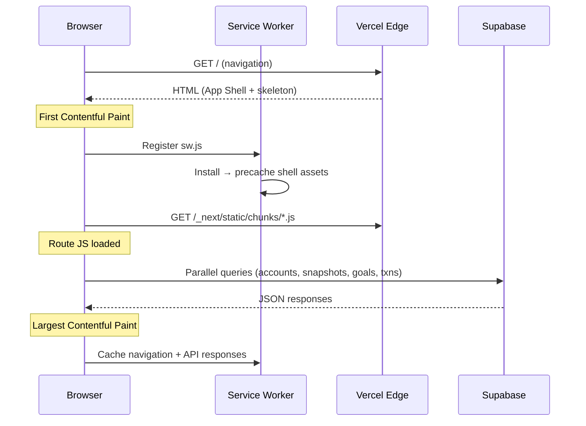
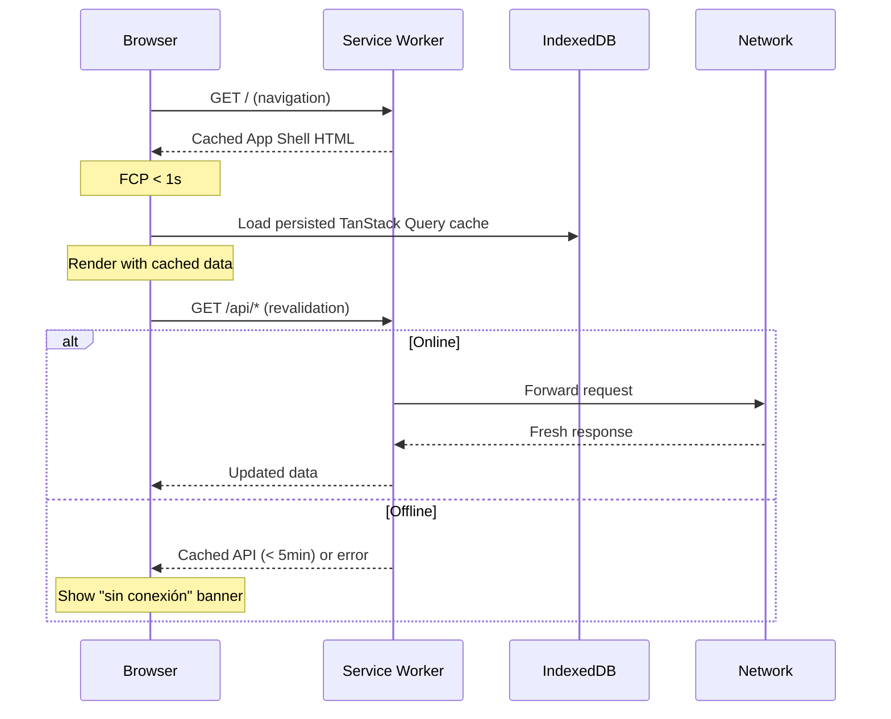

# Design Document: PWA Mobile Performance

## Overview

This design covers a holistic performance optimization of the Maquinita PWA targeting mobile devices on constrained networks (3G/4G). The approach spans the full stack: build-time bundle optimization, runtime rendering performance, network-layer efficiency, intelligent caching via an enhanced service worker, offline-first patterns, mobile UX refinements, asset delivery, and measurable Lighthouse targets.

The architecture leverages Next.js 16 App Router conventions (React Suspense, streaming, route-level code splitting), TanStack Query's cache persistence to IndexedDB, and a versioned service worker with differentiated caching strategies. All changes are incremental — no framework migration or major dependency additions — and are designed to work within Vercel's edge deployment model.

### Key Design Decisions

1. **No workbox** — the existing hand-written `sw.js` is small and well-scoped. We enhance it in place rather than introducing a framework.
2. **TanStack Query persistence** — we add `@tanstack/query-sync-storage-persister` + IndexedDB adapter for offline data survival.
3. **Dynamic imports via `next/dynamic`** — heavy components (Recharts charts, SyncDialog, GoalFormDialog) are lazily loaded per-route.
4. **Virtualization** — long transaction lists use `@tanstack/react-virtual` for DOM node cap.
5. **No SSR for data** — all data queries remain client-side via TanStack Query; the server renders only the App Shell and skeletons.

## Architecture

```mermaid
graph TB
  subgraph Build Time
    BA[Bundle Analyzer] --> CS[Code Splitting]
    CS --> DI[Dynamic Imports]
    DI --> TS[Tree Shaking]
  end

  subgraph Edge / CDN (Vercel)
    HTML[App Shell HTML + Critical CSS]
    STATIC[/_next/static/ hashed assets]
    MANIFEST[manifest.webmanifest]
  end

  subgraph Service Worker
    SW[sw.js v2]
    CACHE_SHELL[Cache: app-shell-v{hash}]
    CACHE_STATIC[Cache: static-v{hash}]
    CACHE_API[Cache: api-v{hash}]
  end

  subgraph Client Runtime
    SHELL[App Shell render]
    RQ[TanStack Query]
    IDB[(IndexedDB persisted cache)]
    VIRT[Virtual list renderer]
  end

  HTML --> SW
  SW --> CACHE_SHELL
  STATIC --> CACHE_STATIC
  SW --> CACHE_API
  RQ --> IDB
  SHELL --> RQ
  RQ --> VIRT
```

### Request Flow (Mobile Cold Start)



### Warm Start / Offline Flow



## Components and Interfaces

### 1. Enhanced Service Worker (`public/sw.js`)

```typescript
// Cache naming with build version
const BUILD_ID = "__BUILD_ID__"; // injected at build time
const CACHE_SHELL = `maquinita-shell-${BUILD_ID}`;
const CACHE_STATIC = `maquinita-static-${BUILD_ID}`;
const CACHE_API = `maquinita-api-${BUILD_ID}`;

// Precache manifest (injected at build)
const PRECACHE_URLS: string[] = [
  "/",
  // core CSS/JS bundles resolved at build
];

interface CacheStrategy {
  cacheName: string;
  strategy: "cache-first" | "network-first" | "stale-while-revalidate";
  maxAge?: number; // seconds
}
```

**Strategies:**
| Path Pattern | Strategy | Fallback | Max Age |
|---|---|---|---|
| `/_next/static/**` | cache-first | — | ∞ (content-hashed) |
| Navigation requests | network-first | cached shell | — |
| `/api/*` (same-origin) | network-first | cached response | 5 min |
| Cross-origin | pass-through | — | — |

### 2. Query Persistence Layer

```typescript
// src/lib/query-persist.ts
import { createSyncStoragePersister } from "@tanstack/query-sync-storage-persister";
import { persistQueryClient } from "@tanstack/react-query-persist-client";

interface PersistConfig {
  maxAge: number;          // 7 days in ms
  buster: string;          // build version for cache busting
  serialize: (data: unknown) => string;
  deserialize: (raw: string) => unknown;
}

// IndexedDB wrapper implementing Storage interface
interface IDBStorageAdapter {
  getItem(key: string): Promise<string | null>;
  setItem(key: string, value: string): Promise<void>;
  removeItem(key: string): Promise<void>;
}
```

### 3. Offline Status Provider

```typescript
// src/components/offline-banner.tsx
interface OfflineState {
  isOnline: boolean;
  lastOnlineAt: Date | null;
}

// Fixed-position banner component
// Pushes content down via top padding adjustment
// Text: "sin conexión" (Spanish)
```

### 4. SW Update Toast

```typescript
// src/components/sw-update-toast.tsx
interface SwUpdateState {
  hasUpdate: boolean;
  onReload: () => void;
  onDismiss: () => void;
}

// Bottom toast: "actualización disponible" + reload button
// Auto-dismiss after 10 seconds
```

### 5. Virtual List Wrapper

```typescript
// src/components/virtual-list.tsx
import { useVirtualizer } from "@tanstack/react-virtual";

interface VirtualListProps<T> {
  items: T[];
  estimateSize: number;       // px per row
  overscan?: number;          // default: 5
  renderItem: (item: T, index: number) => React.ReactNode;
}
```

### 6. Dynamic Import Wrappers

```typescript
// src/components/lazy/index.ts
import dynamic from "next/dynamic";

export const LazyNetWorthLineChart = dynamic(
  () => import("@/components/charts/net-worth-line-chart").then(m => ({ default: m.NetWorthLineChart })),
  { loading: () => <ChartSkeleton height={256} /> }
);

export const LazyCategoryPieChart = dynamic(
  () => import("@/components/charts/category-pie-chart").then(m => ({ default: m.CategoryPieChart })),
  { loading: () => <ChartSkeleton height={256} /> }
);

export const LazySyncDialog = dynamic(
  () => import("@/components/sync-dialog").then(m => ({ default: m.SyncDialog })),
  { ssr: false }
);

export const LazyGoalFormDialog = dynamic(
  () => import("@/components/goal-form-dialog").then(m => ({ default: m.GoalFormDialog })),
  { ssr: false }
);
```

### 7. Bundle Analyzer Configuration

```typescript
// next.config.ts additions
import type { NextConfig } from "next";

const nextConfig: NextConfig = {
  experimental: {
    optimizePackageImports: ["lucide-react", "recharts", "date-fns"],
  },
  // Bundle analyzer via ANALYZE=true env var
  ...(process.env.ANALYZE === "true" && {
    webpack(config) {
      const { BundleAnalyzerPlugin } = require("webpack-bundle-analyzer");
      config.plugins.push(new BundleAnalyzerPlugin({ analyzerMode: "static" }));
      return config;
    },
  }),
};
```

### 8. Route Prefetch Enhancement

The App Shell navigation links already use `<Link>` from `next/link`, which provides viewport-based prefetching by default in Next.js 16. We enhance with:

```typescript
// Touch/hover prefetch in app-shell.tsx
<Link
  href={href}
  prefetch={true}           // explicit viewport prefetch
  onTouchStart={() => {}}   // triggers prefetch on touch
>
```

## Data Models

### Service Worker Cache Schema

```
Cache: maquinita-shell-{buildId}
  Keys: navigation URLs (/, /gastos, /patrimonio, /objetivos, /cierre)
  Values: full HTML responses

Cache: maquinita-static-{buildId}
  Keys: /_next/static/** URLs
  Values: JS/CSS/font files (immutable, content-hashed)

Cache: maquinita-api-{buildId}
  Keys: /api/* URLs
  Values: JSON responses
  Metadata: X-Cache-Time header injected on cache write
```

### IndexedDB TanStack Query Persistence

```
Database: maquinita-query-cache
  ObjectStore: queries
    Key: queryKey hash string
    Value: { state: DehydratedState, timestamp: number, buster: string }
    Max age: 7 days
```

### Performance Budget Model

| Route | First-load JS (gzipped) | Target LCP | Target INP |
|---|---|---|---|
| `/` (dashboard) | < 150 KB | < 2.5s | < 200ms |
| `/gastos` | < 200 KB | < 2.5s | < 200ms |
| `/patrimonio` | < 200 KB | < 2.5s | < 200ms |
| `/objetivos` | < 120 KB | < 2.0s | < 200ms |
| `/cierre` | < 120 KB | < 2.0s | < 200ms |


## Correctness Properties

*A property is a characteristic or behavior that should hold true across all valid executions of a system — essentially, a formal statement about what the system should do. Properties serve as the bridge between human-readable specifications and machine-verifiable correctness guarantees.*

### Property 1: Virtual list DOM node cap

*For any* list of N items where N > 50, the virtual list renderer SHALL produce no more than (visible_count + 20) DOM nodes at any scroll position, where visible_count is the number of items fitting within the viewport height.

**Validates: Requirements 2.6**

### Property 2: Service Worker API cache expiry enforcement

*For any* cached API response with a cache timestamp T, if `Date.now() - T > 5 * 60 * 1000` (5 minutes), the Service Worker SHALL return a network error response rather than the stale cached data.

**Validates: Requirements 4.4**

### Property 3: Versioned cache cleanup on activation

*For any* set of Cache Storage entries with names containing version identifiers, when a new Service Worker activates with version V, all caches whose name does not contain V SHALL be deleted, and only caches containing V SHALL remain.

**Validates: Requirements 4.5**

### Property 4: Cross-origin request passthrough

*For any* fetch request whose URL origin differs from the Service Worker's origin, the Service Worker SHALL NOT call `event.respondWith()`, allowing the request to pass through to the network unmodified.

**Validates: Requirements 4.7**

### Property 5: Query cache persistence round-trip

*For any* valid TanStack Query dehydrated state object, serializing it to IndexedDB and then deserializing it back SHALL produce a value deeply equal to the original state.

**Validates: Requirements 5.3**

### Property 6: Persisted cache max age enforcement

*For any* persisted query cache entry with a timestamp T, if `Date.now() - T > 7 * 24 * 60 * 60 * 1000` (7 days), the persistence layer SHALL discard the entry and the UI SHALL display a placeholder state instead of stale data.

**Validates: Requirements 5.2**

### Property 7: Interactive elements meet mobile UX constraints

*For any* interactive element (button, link, tab trigger, form input) rendered in the app, the element SHALL have a computed `touch-action` including `manipulation` AND a rendered bounding box of at least 44×44 CSS pixels.

**Validates: Requirements 6.2, 6.4**

### Property 8: Image elements have explicit dimensions

*For any* `` element rendered in the app, the element SHALL have explicit `width` and `height` attributes (or equivalent CSS that prevents layout shift) to avoid CLS during image loading.

**Validates: Requirements 7.4**

## Error Handling

### Network Failures

| Scenario | Behavior |
|---|---|
| Query fetch fails (first attempt) | TanStack Query retries once after 2s delay (configured via `retry: 1`, `retryDelay: 2000`) |
| Query fetch fails (after retry) | Non-blocking toast "No se pudieron cargar los datos" visible for 5s. Cached data remains on screen if available. |
| SW navigation fetch fails (offline) | Serve cached App Shell HTML. Show "sin conexión" fixed banner. |
| SW API fetch fails (offline, cache < 5min) | Serve cached API response. |
| SW API fetch fails (offline, cache > 5min) | Return network error → triggers TanStack Query error handler. |
| Prefetch fails | Silent failure. On-demand loading on navigation with skeleton placeholder. |

### Persistence Failures

| Scenario | Behavior |
|---|---|
| IndexedDB write fails | Log warning to console. Continue with in-memory cache only. No user interruption. |
| IndexedDB read fails on startup | Initialize empty query cache. Fetch all data fresh from network. |
| IndexedDB unavailable (private browsing) | Skip persistence entirely. In-memory cache only. |

### Service Worker Lifecycle

| Scenario | Behavior |
|---|---|
| SW install fails | App continues without SW. Network requests go directly to Vercel. |
| New SW installed, waiting | Show bottom toast "actualización disponible" with reload button. Auto-dismiss after 10s. |
| User clicks reload | Call `registration.waiting.postMessage({ type: 'SKIP_WAITING' })`. SW activates. Page reloads. |
| Cache storage quota exceeded | Evict oldest API cache entries. Log warning. |

### Rendering Edge Cases

| Scenario | Behavior |
|---|---|
| Data loads before skeleton mounts | Skip skeleton, render data directly (React Suspense handles this naturally). |
| Virtual list receives empty array | Render empty state component, no virtualizer instantiation. |
| Font fails to load | `font-display: swap` ensures system font remains visible. No layout shift. |
| Critical CSS missing (edge case) | Tailwind CSS is bundled, not fetched externally — this cannot occur in normal builds. |

## Testing Strategy

### Unit Tests (Vitest)

Focus on pure logic and configuration:

- **Cache age validation logic**: Test the `isCacheExpired(timestamp, maxAge)` utility function with specific age values.
- **SW route matching**: Test the URL pattern matching logic (is it `/_next/static/`? Is it cross-origin? Is it `/api/`?).
- **IndexedDB adapter**: Test serialize/deserialize with known objects.
- **Offline state hook**: Test the `useOnlineStatus` hook responds to online/offline events.
- **Skeleton dimension matching**: Snapshot-test skeleton components to catch dimension regressions.

### Property-Based Tests (Vitest + fast-check)

Property-based testing library: **fast-check** (already in devDependencies).

Configuration:
- Minimum 100 iterations per property test
- Tag format: `Feature: pwa-mobile-performance, Property {N}: {title}`

Applicable properties:
1. **Virtual list DOM cap** — generate random item counts (51–2000), random viewport heights, verify DOM node bound.
2. **SW API cache expiry** — generate random timestamps spanning 0–10 minutes ago, verify correct accept/reject decision.
3. **Versioned cache cleanup** — generate random sets of cache names with random version strings, verify only matching version survives.
4. **Cross-origin passthrough** — generate random URLs with varying origins, verify the SW routing function correctly classifies each.
5. **Query cache round-trip** — generate random dehydrated state objects (nested JSON), persist/restore, verify deep equality.
6. **Persisted cache max age** — generate random timestamps spanning 0–14 days, verify correct accept/discard decision.
7. **Interactive element UX constraints** — generate sets of mock DOM elements with random dimensions and styles, verify the validation function correctly identifies compliant/non-compliant elements.
8. **Image explicit dimensions** — generate mock img elements with/without width/height, verify validation catches missing dimensions.

### Integration Tests

- **Lighthouse CI** (in CI pipeline): Run against deployed preview. Assert Performance ≥ 90, Best Practices ≥ 95, Accessibility ≥ 95, PWA badge.
- **Bundle size checks** (in CI): Parse `next build` output, assert per-route budgets.
- **Offline behavior** (Playwright): Navigate online → go offline → verify banner + cached content → go online → verify revalidation.
- **SW update flow** (Playwright): Serve app with SW v1 → deploy v2 → verify toast notification + reload behavior.

### Performance Profiling (Manual + CI)

- Chrome DevTools Performance panel with 4× CPU throttling + 3G simulation.
- WebPageTest runs from mobile device profiles (Moto G Power).
- Vercel Analytics for real-user TTFB monitoring.

### CI Pipeline Integration

```
build → bundle-size-check → lighthouse-ci → deploy (only if all pass)
```

The `bundle-size-check` step parses `next build` output and fails if any route exceeds its budget. Lighthouse CI runs 3 times per route and uses the median score. Deployment is gated on both passing.
