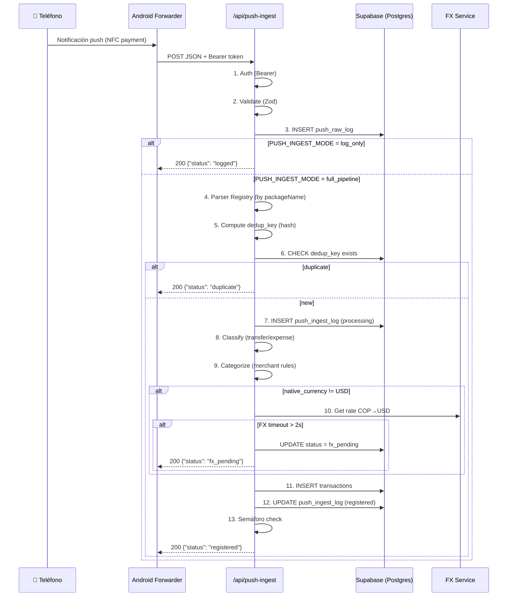
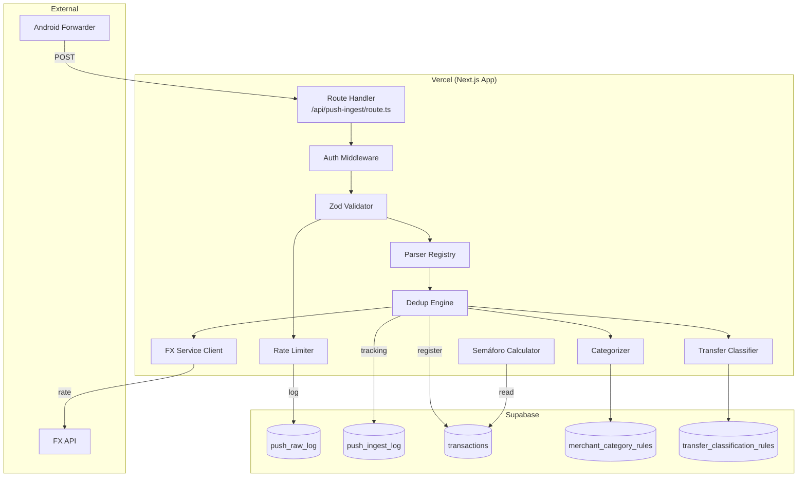

# Design Document: Realtime Expense Sensor

## Overview

Sistema de ingesta automática de gastos en tiempo real basado en notificaciones push de pagos NFC. Un Route Handler de Next.js (`/api/push-ingest`) recibe POSTs de un Notification Forwarder Android (app de terceros), valida, parsea, deduplica, convierte moneda, registra en la tabla `transactions` de Maquinita y evalúa un semáforo de presupuesto mensual.

El sistema opera en fases incrementales controladas por variable de entorno:
- **Fase 0** (`log_only`): Solo almacena payloads crudos para análisis
- **Fase 1** (`full_pipeline`): Pipeline completo de parsing → registro
- **Fase 2**: Cross-source dedup + semáforo + alertas

### Decisiones de Diseño Clave

| Decisión | Valor | Justificación |
|----------|-------|---------------|
| Runtime | Next.js Route Handler | Mismo deploy Vercel, sin infra nueva |
| Auth webhook | Bearer token estático | Simple, suficiente para single-user |
| DB writes | `@supabase/supabase-js` con service role key | Bypass RLS, mismo patrón que `maquinita-mcp` |
| Parsers | Registry pattern (Map<packageName, parser>) | Extensible sin tocar pipeline |
| Semáforo | Función pura exportable | Testeable por PBT, sin side effects |
| Rate limiting | In-memory sliding window | Vercel serverless = reset por cold start, suficiente para protección básica |
| FX | Configurable via env, con fallback `fx_pending` | No bloquear respuesta si FX falla |

## Architecture

### Diagrama de Flujo Principal



### Diagrama de Componentes



### Estructura de Archivos

```
src/
  app/
    api/
      push-ingest/
        route.ts              ← Route Handler principal
  lib/
    push-ingest/
      schemas.ts              ← Zod schemas para payload
      auth.ts                 ← Validación Bearer token
      rate-limiter.ts         ← Sliding window in-memory
      parser-registry.ts      ← Map<packageName, ParserFn>
      parsers/
        bancolombia.ts        ← Parser Bancolombia (Fase 1)
        rappi.ts              ← Parser RappiCard (Fase 1)
        google-wallet.ts      ← Parser Google Wallet (Fase 1)
        nexo.ts               ← Parser Nexo (Fase 1)
      dedup.ts                ← Dedup key computation + check
      fx.ts                   ← FX service client
      categorizer.ts          ← Merchant → category rules
      classifier.ts           ← Transfer classification
      semaphore.ts            ← Función pura del semáforo
      pipeline.ts             ← Orquestador del pipeline completo
      types.ts                ← Tipos compartidos
      supabase-admin.ts       ← Supabase client con service role key
  components/
    semaphore-gauge.tsx       ← Componente UI del semáforo (Fase 2)
  hooks/
    use-semaphore.ts          ← TanStack Query hook para semáforo
```

## Components and Interfaces

### Tipos Centrales

```typescript
// src/lib/push-ingest/types.ts

/** Payload crudo del Android Notification Forwarder */
export type PushPayload = {
  packageName: string;
  title: string;
  text: string;
  timestamp: number | string; // epoch ms or ISO string
  postTime?: number;
  key?: string;
  extras?: Record<string, unknown>;
};

/** Resultado de un parser exitoso */
export type ParsedTransaction = {
  amount_native: number;
  native_currency: string; // "COP" | "USD" | "USDT" | etc
  merchant: string | null;
  tx_date: string; // YYYY-MM-DD
  description_raw: string;
  account_name: string;
};

/** Tipo de función parser */
export type ParserFn = (payload: PushPayload) => ParsedTransaction | null;

/** Estado del semáforo */
export type SemaphoreState = "verde" | "amarillo" | "rojo";

/** Resultado del cálculo del semáforo */
export type SemaphoreResult = {
  state: SemaphoreState;
  spent: number;        // gasto acumulado del mes (USD)
  ceiling: number;      // techo T (USD)
  pct: number;          // porcentaje consumido (0-1+)
  expected_pct: number; // porcentaje esperado para el día actual
  day: number;          // día del mes actual
  days_in_month: number;
};

/** Resultado del pipeline */
export type PipelineResult =
  | { status: "logged" }
  | { status: "duplicate"; dedup_key: string }
  | { status: "no_parser"; package_name: string }
  | { status: "registered"; transaction_id: string; semaphore?: SemaphoreResult }
  | { status: "fx_pending"; dedup_key: string }
  | { status: "deduped_cross_source"; kept_key: string }
  | { status: "registration_failed"; error: string };

/** Modos de operación */
export type IngestMode = "log_only" | "full_pipeline";

/** Entrada para el cálculo del semáforo (función pura) */
export type SemaphoreInput = {
  accumulated_spend: number; // gasto acumulado del mes en USD
  ceiling: number;           // techo T en USD
  current_day: number;       // día actual del mes (1-based)
  days_in_month: number;     // total de días del mes
};
```

### Auth Module

```typescript
// src/lib/push-ingest/auth.ts

export type AuthResult =
  | { ok: true }
  | { ok: false; status: 401; body: { error: "unauthorized" } };

/** Valida Bearer token contra PUSH_INGEST_SECRET */
export function validateAuth(authHeader: string | null): AuthResult;
```

### Rate Limiter

```typescript
// src/lib/push-ingest/rate-limiter.ts

export type RateLimitResult =
  | { allowed: true }
  | { allowed: false; retryAfter: number };

/** Sliding window rate limiter (in-memory, resets on cold start) */
export function checkRateLimit(ip: string): RateLimitResult;
```

### Parser Registry

```typescript
// src/lib/push-ingest/parser-registry.ts

/** Registry de parsers indexado por package name */
export const parserRegistry: Map<string, ParserFn>;

/** Busca un parser para el package name dado */
export function getParser(packageName: string): ParserFn | undefined;

/** Registra un parser (para extensibilidad) */
export function registerParser(packageName: string, parser: ParserFn): void;
```

### Dedup Engine

```typescript
// src/lib/push-ingest/dedup.ts

/** Calcula el dedup key: hash(packageName + title + text + minute-truncated-timestamp) */
export function computeDedupKey(payload: PushPayload): string;

/** Verifica si el dedup_key ya existe en push_ingest_log */
export async function isDuplicate(dedupKey: string): Promise<boolean>;

/** Cross-source dedup: busca transacciones del mismo monto en ventana de 2 min */
export async function findCrossSourceDuplicate(
  amount_native: number,
  excludePackage: string,
  timestamp: Date,
): Promise<{ dedup_key: string; merchant: string | null } | null>;
```

### FX Service

```typescript
// src/lib/push-ingest/fx.ts

export type FxResult =
  | { ok: true; rate: number }
  | { ok: false; reason: "timeout" | "error" };

/** Obtiene tasa de cambio. Timeout configurable (default 2s) */
export async function getExchangeRate(
  from: string,
  to: string,
  timeoutMs?: number,
): Promise<FxResult>;

/** Wrapper: si USD/USDT retorna 1, sino consulta el servicio */
export async function resolveRate(nativeCurrency: string): Promise<FxResult>;
```

### Categorizer

```typescript
// src/lib/push-ingest/categorizer.ts

export type CategorizationResult =
  | { matched: true; category_id: string; rule_id: string }
  | { matched: false };

/** Busca en merchant_category_rules una regla que matchee */
export async function categorize(merchant: string | null): Promise<CategorizationResult>;
```

### Transfer Classifier

```typescript
// src/lib/push-ingest/classifier.ts

export type ClassificationResult =
  | { type: "expense" }
  | { type: "transfer"; is_payment: true }
  | { type: "unknown"; needs_review: true };

/** Evalúa si un movimiento es transferencia usando transfer_classification_rules */
export async function classify(parsed: ParsedTransaction): Promise<ClassificationResult>;
```

### Semáforo (Función Pura)

```typescript
// src/lib/push-ingest/semaphore.ts

/**
 * Función pura: calcula el estado del semáforo.
 * 
 * - verde:    gasto < T × (día_actual / días_totales)
 * - amarillo: T × (día_actual / días_totales) ≤ gasto < T
 * - rojo:     gasto ≥ T
 */
export function computeSemaphore(input: SemaphoreInput): SemaphoreResult;
```

### Supabase Admin Client

```typescript
// src/lib/push-ingest/supabase-admin.ts

import { createClient } from "@supabase/supabase-js";

/** Cliente Supabase con service role key (bypass RLS).
 *  Singleton — reutilizable entre invocaciones dentro del mismo container. */
export const supabaseAdmin = createClient(
  process.env.NEXT_PUBLIC_SUPABASE_URL!,
  process.env.SUPABASE_SERVICE_ROLE_KEY!,
  { auth: { persistSession: false } }
);
```

### Pipeline Orchestrator

```typescript
// src/lib/push-ingest/pipeline.ts

import type { PushPayload, PipelineResult, IngestMode } from "./types";

/** Ejecuta el pipeline según el modo configurado */
export async function executePipeline(
  payload: PushPayload,
  mode: IngestMode,
  userId: string,
): Promise<PipelineResult>;
```

## Data Models

### Tabla: `push_raw_log` (Nueva)

```sql
CREATE TABLE public.push_raw_log (
  id           uuid PRIMARY KEY DEFAULT gen_random_uuid(),
  user_id      uuid NOT NULL REFERENCES auth.users(id) ON DELETE CASCADE,
  package_name text NOT NULL,
  payload      jsonb NOT NULL,
  received_at  timestamptz NOT NULL DEFAULT now(),
  created_at   timestamptz NOT NULL DEFAULT now()
);

-- RLS deshabilitado (escritura exclusiva por service role key)
ALTER TABLE public.push_raw_log DISABLE ROW LEVEL SECURITY;

-- Índice para consultas cronológicas
CREATE INDEX idx_push_raw_log_user_received 
  ON public.push_raw_log(user_id, received_at);
```

### Tabla: `push_ingest_log` (Nueva)

```sql
CREATE TABLE public.push_ingest_log (
  dedup_key        text PRIMARY KEY,
  user_id          uuid NOT NULL REFERENCES auth.users(id) ON DELETE CASCADE,
  package_name     text NOT NULL,
  amount_native    numeric(20, 4),
  native_currency  text,
  amount_usd       numeric(20, 4),
  merchant         text,
  status           text NOT NULL DEFAULT 'processing',
  transaction_id   uuid REFERENCES public.transactions(id) ON DELETE SET NULL,
  raw_log_id       uuid REFERENCES public.push_raw_log(id) ON DELETE SET NULL,
  related_dedup_key text, -- referencia al key retenido en cross-source dedup
  error_message    text,
  created_at       timestamptz NOT NULL DEFAULT now(),
  updated_at       timestamptz NOT NULL DEFAULT now()
);

-- Constraint: status es uno de los valores válidos
ALTER TABLE public.push_ingest_log 
  ADD CONSTRAINT chk_ingest_status 
  CHECK (status IN (
    'processing', 'registered', 'duplicate', 
    'deduped_cross_source', 'no_parser', 'fx_pending', 
    'registration_failed', 'transfer'
  ));

-- RLS deshabilitado
ALTER TABLE public.push_ingest_log DISABLE ROW LEVEL SECURITY;

-- Índice para cross-source dedup (buscar por monto + ventana temporal)
CREATE INDEX idx_push_ingest_amount_created 
  ON public.push_ingest_log(amount_native, created_at);

-- Índice para queries de estado
CREATE INDEX idx_push_ingest_status 
  ON public.push_ingest_log(status);
```

### Tabla: `merchant_category_rules` (Nueva)

```sql
CREATE TABLE public.merchant_category_rules (
  id          uuid PRIMARY KEY DEFAULT gen_random_uuid(),
  user_id     uuid NOT NULL REFERENCES auth.users(id) ON DELETE CASCADE,
  pattern     text NOT NULL,        -- regex o ILIKE pattern
  match_type  text NOT NULL DEFAULT 'ilike', -- 'ilike' | 'regex'
  category_id uuid NOT NULL REFERENCES public.categories(id) ON DELETE CASCADE,
  priority    integer NOT NULL DEFAULT 0, -- mayor = más específica
  created_at  timestamptz NOT NULL DEFAULT now()
);

ALTER TABLE public.merchant_category_rules DISABLE ROW LEVEL SECURITY;

CREATE INDEX idx_merchant_rules_user_priority 
  ON public.merchant_category_rules(user_id, priority DESC);
```

### Tabla: `transfer_classification_rules` (Nueva)

```sql
CREATE TABLE public.transfer_classification_rules (
  id          uuid PRIMARY KEY DEFAULT gen_random_uuid(),
  user_id     uuid NOT NULL REFERENCES auth.users(id) ON DELETE CASCADE,
  pattern     text NOT NULL,
  match_type  text NOT NULL DEFAULT 'ilike',
  list_type   text NOT NULL DEFAULT 'allowlist', -- 'allowlist' | 'denylist'
  description text,
  created_at  timestamptz NOT NULL DEFAULT now()
);

ALTER TABLE public.transfer_classification_rules DISABLE ROW LEVEL SECURITY;

CREATE INDEX idx_transfer_rules_user 
  ON public.transfer_classification_rules(user_id);
```

### Modificación: `transactions` (columna `needs_review`)

```sql
-- Agregar columna si no existe
ALTER TABLE public.transactions
  ADD COLUMN IF NOT EXISTS needs_review boolean NOT NULL DEFAULT false;

-- Agregar columna source para trazabilidad
ALTER TABLE public.transactions
  ADD COLUMN IF NOT EXISTS source text NOT NULL DEFAULT 'manual';
  -- Valores: 'manual' | 'push_ingest' | 'email_ingest' | 'mcp'

COMMENT ON COLUMN public.transactions.needs_review IS 
  'True cuando el sistema no pudo categorizar automáticamente. El usuario debe revisar.';
COMMENT ON COLUMN public.transactions.source IS 
  'Origen de la transacción: manual | push_ingest | email_ingest | mcp.';
```

### Zod Schemas

```typescript
// src/lib/push-ingest/schemas.ts

import { z } from "zod";

/** Schema estricto para el payload del Android Notification Forwarder */
export const pushPayloadSchema = z.object({
  packageName: z.string().min(1),
  title: z.string(),
  text: z.string(),
  timestamp: z.union([
    z.number().int().positive(),     // epoch ms
    z.string().datetime(),           // ISO 8601
  ]),
  // Campos opcionales (TBD pendiente Fase 0)
  postTime: z.number().int().optional(),
  key: z.string().optional(),
  extras: z.record(z.unknown()).optional(),
});

export type PushPayloadInput = z.infer<typeof pushPayloadSchema>;

/** Schema para la respuesta del endpoint */
export const pushResponseSchema = z.discriminatedUnion("status", [
  z.object({ status: z.literal("logged") }),
  z.object({ status: z.literal("duplicate"), dedup_key: z.string() }),
  z.object({ status: z.literal("no_parser"), package_name: z.string() }),
  z.object({ status: z.literal("registered"), transaction_id: z.string() }),
  z.object({ status: z.literal("fx_pending"), dedup_key: z.string() }),
  z.object({ status: z.literal("deduped_cross_source"), kept_key: z.string() }),
  z.object({ status: z.literal("registration_failed"), error: z.string() }),
]);
```


## Correctness Properties

*A property is a characteristic or behavior that should hold true across all valid executions of a system — essentially, a formal statement about what the system should do. Properties serve as the bridge between human-readable specifications and machine-verifiable correctness guarantees.*

### Property 1: Auth Validation Correctness

*For any* HTTP request to `/api/push-ingest`, the request is accepted for processing if and only if the `Authorization` header contains `Bearer <token>` where `<token>` matches the configured `PUSH_INGEST_SECRET`. All other requests (missing header, wrong token, malformed header) SHALL receive HTTP 401 with `{"error": "unauthorized"}`.

**Validates: Requirements 1.1, 1.2, 1.3**

### Property 2: Schema Validation Completeness

*For any* JSON object, the Zod validation passes if and only if the object contains valid `packageName` (non-empty string), `title` (string), `text` (string), and `timestamp` (positive integer or ISO datetime string). Invalid payloads receive HTTP 422 with Zod error details; valid payloads proceed to the pipeline.

**Validates: Requirements 2.1, 2.2, 2.3, 2.4**

### Property 3: Raw Log Storage Round-Trip

*For any* valid authenticated payload, the row inserted in `push_raw_log` SHALL contain the exact original JSON payload (byte-equivalent when re-serialized), the `package_name` matching `payload.packageName`, and a `received_at` timestamp within 1 second of actual receipt time.

**Validates: Requirements 3.1**

### Property 4: Rate Limiter Monotonic Rejection

*For any* IP address and configured limit N per window W, the first N requests within window W are accepted, and requests N+1 through N+K are rejected with HTTP 429 and a `Retry-After` header > 0. Furthermore, rate-limited requests SHALL NOT produce any `push_raw_log` insertion.

**Validates: Requirements 4.1, 4.2, 4.3**

### Property 5: Dedup Key Determinism and Collision

*For any* two payloads P1 and P2, `computeDedupKey(P1) === computeDedupKey(P2)` if and only if `P1.packageName === P2.packageName AND P1.title === P2.title AND P1.text === P2.text AND floor(P1.timestamp / 60000) === floor(P2.timestamp / 60000)`. The function is pure and deterministic.

**Validates: Requirements 6.1**

### Property 6: FX Calculation Correctness

*For any* `(amount_native, native_currency, fx_rate)` tuple: if `native_currency` is `"USD"` or `"USDT"`, then `fx_rate_to_usd` SHALL equal `1` and `amount_usd === amount_native`; otherwise `amount_usd === Math.round(amount_native * fx_rate * 10000) / 10000`. All four fields (`amount_native`, `native_currency`, `fx_rate_to_usd`, `amount_usd`) SHALL be stored in the transaction row.

**Validates: Requirements 7.2, 7.3, 7.4**

### Property 7: Semaphore State Correctness

*For any* valid `SemaphoreInput` where `ceiling > 0`, `current_day ∈ [1, days_in_month]`, and `days_in_month ∈ [28, 31]`:
- `computeSemaphore` returns `"verde"` iff `accumulated_spend < ceiling × (current_day / days_in_month)`
- `computeSemaphore` returns `"amarillo"` iff `ceiling × (current_day / days_in_month) ≤ accumulated_spend < ceiling`
- `computeSemaphore` returns `"rojo"` iff `accumulated_spend ≥ ceiling`

The function is pure (same input always produces same output, no side effects).

**Validates: Requirements 12.2, 12.3, 12.4, 12.5**

### Property 8: Merchant Categorization Priority

*For any* merchant string M and ordered set of rules R, the categorizer SHALL return the `category_id` of the highest-priority rule whose pattern matches M. If no rule matches, the result SHALL be `{ matched: false }` and the transaction SHALL have `category_id = null` and `needs_review = true`.

**Validates: Requirements 9.1, 9.2, 9.3, 9.4**

### Property 9: Transfer Classification Trichotomy

*For any* parsed transaction T and set of classification rules:
- If T matches an allowlist rule → `is_payment = true` (transfer)
- If T matches a denylist rule → `is_payment = false` (expense)
- If no rule matches → `is_payment = false` and `needs_review = true`

These three outcomes are mutually exclusive and exhaustive.

**Validates: Requirements 10.1, 10.2, 10.3, 10.4**

### Property 10: Cross-Source Dedup Window

*For any* two payloads from different packages with the same `amount_native`, they are considered duplicates if and only if their timestamps differ by ≤ 2 minutes. Payloads with timestamps > 2 minutes apart SHALL always be treated as distinct transactions.

**Validates: Requirements 11.1, 11.5**

### Property 11: Cross-Source Dedup Retention Selection

*For any* two cross-source duplicate transactions, the system SHALL retain the one with a non-null `merchant` field. If both have equal informativeness (both null or both non-null merchant), the system SHALL retain the one with the earlier `created_at` timestamp.

**Validates: Requirements 11.2, 11.3**

### Property 12: Alert Idempotency

*For any* semaphore state transition (state_before, state_after) within the same calendar month, the system SHALL dispatch exactly one alert. Repeated detections of the same transition SHALL NOT produce additional alerts.

**Validates: Requirements 14.4**

### Property 13: Mode Fallback Safety

*For any* value of `PUSH_INGEST_MODE` that is not exactly `"full_pipeline"`, the system SHALL behave identically to `"log_only"` mode: authenticate → validate → log raw → respond 200 `{"status": "logged"}`, without executing parsing, dedup, FX, or registration.

**Validates: Requirements 17.2, 17.4**

## Error Handling

### Estrategia por Capa

| Capa | Error | Acción | HTTP Response |
|------|-------|--------|---------------|
| Auth | Token inválido/ausente | Rechazar inmediatamente | 401 `{"error": "unauthorized"}` |
| Rate Limit | IP excede límite | Rechazar sin logging | 429 + `Retry-After` header |
| JSON Parse | Body no es JSON válido | Rechazar | 400 `{"error": "invalid_json"}` |
| Zod Validation | Payload no cumple schema | Rechazar con detalles | 422 `{"errors": [...]}` |
| Raw Log INSERT | DB write falla | Abortar pipeline | 500 `{"error": "log_failed"}` |
| Parser | No hay parser para package | Marcar `no_parser` en ingest_log | 200 `{"status": "no_parser"}` |
| Parser | Parser throw / retorna null | Marcar `parse_failed` | 200 `{"status": "parse_failed"}` |
| Dedup | Key ya existe | Marcar duplicado | 200 `{"status": "duplicate"}` |
| FX Service | Timeout > 2s | Marcar `fx_pending` | 200 `{"status": "fx_pending"}` |
| FX Service | Error de red/API | Marcar `fx_pending` | 200 `{"status": "fx_pending"}` |
| Transaction INSERT | DB write falla | Marcar `registration_failed` | 200 `{"status": "registration_failed"}` |
| Account resolution | account_name no encontrado | Log error + skip | 200 `{"status": "registration_failed"}` |

### Principios

1. **Never lose data**: El INSERT en `push_raw_log` es síncrono y obligatorio antes de responder. Si falla, es el único caso de 500.
2. **Respond fast**: Errores de pipeline downstream (parser, FX, registration) NO producen error HTTP. El payload ya está logueado; el estado se trackea en `push_ingest_log`.
3. **Fail open en modo**: Si `PUSH_INGEST_MODE` es desconocido, operar en `log_only` (seguro).
4. **Idempotent responses**: El forwarder puede reintentar. Duplicados se detectan por `dedup_key` y responden 200 sin side effects.

### Retry Strategy (FX Pending)

Para transacciones marcadas `fx_pending`:
- Un cron job o invocación manual (TBD) consultará `push_ingest_log WHERE status = 'fx_pending'`
- Reintentará la conversión FX y completará el registro
- Backoff: 5 min → 15 min → 1 hora → manual review

## Testing Strategy

### Property-Based Testing (PBT)

**Library**: `fast-check` (TypeScript, compatible con el test runner del proyecto)

**Configuración**:
- Mínimo 100 iteraciones por propiedad
- Cada test referencia su propiedad del documento de diseño
- Tag format: `Feature: realtime-expense-sensor, Property {N}: {title}`

**Propiedades testeables por PBT** (funciones puras sin side effects):

| Propiedad | Función bajo test | Generador |
|-----------|-------------------|-----------|
| P1: Auth Validation | `validateAuth(header)` | Strings arbitrarios, null, Bearer + random tokens |
| P2: Schema Validation | `pushPayloadSchema.safeParse(obj)` | Objetos random, payloads válidos mutados |
| P5: Dedup Key | `computeDedupKey(payload)` | Payloads con variaciones de timestamp |
| P6: FX Calculation | `computeAmountUsd(amount, currency, rate)` | Números arbitrarios, monedas USD/USDT/COP/ARS |
| P7: Semaphore | `computeSemaphore(input)` | SemaphoreInput con rangos válidos |
| P8: Categorization | `categorize(merchant, rules)` | Strings + arrays de reglas con prioridades |
| P9: Classification | `classify(parsed, rules)` | ParsedTransaction + rules allowlist/denylist |
| P10: Cross-Source Window | `isWithinDedupWindow(t1, t2)` | Pares de timestamps |
| P11: Retention Selection | `selectRetained(tx1, tx2)` | Pares de transacciones con/sin merchant |
| P13: Mode Fallback | `resolveMode(envValue)` | Strings arbitrarios |

### Unit Tests (Example-Based)

- Parser específicos (Bancolombia, Rappi, etc.) — con golden payloads recolectados en Fase 0
- Error paths: DB failures mockeados, FX timeout, parser exceptions
- Rate limiter edge cases: ventana exacta, reset after window
- Account resolution: nombres válidos e inválidos

### Integration Tests

- Pipeline end-to-end en modo `log_only`: payload → push_raw_log row → 200
- Pipeline end-to-end en modo `full_pipeline`: payload → raw log → ingest log → transaction → 200
- Dedup: mismo payload enviado 2 veces → segundo es `duplicate`
- Cross-source dedup: dos payloads distintos paquetes, mismo monto, < 2 min
- FX timeout: mock slow FX → `fx_pending` → retry resuelve

### Test Runner

El proyecto no tiene test runner configurado actualmente. Se recomienda agregar:

```json
{
  "devDependencies": {
    "vitest": "^3.x",
    "fast-check": "^4.x",
    "@testing-library/react": "^16.x"
  },
  "scripts": {
    "test": "vitest --run",
    "test:watch": "vitest"
  }
}
```

### Cobertura Target

- Funciones puras (semaphore, dedup key, FX calc, auth): 100% via PBT
- Parsers: 90%+ con golden payloads reales (post Fase 0)
- Pipeline integration: happy path + principales error paths
- UI semáforo: snapshot tests para los 3 estados
